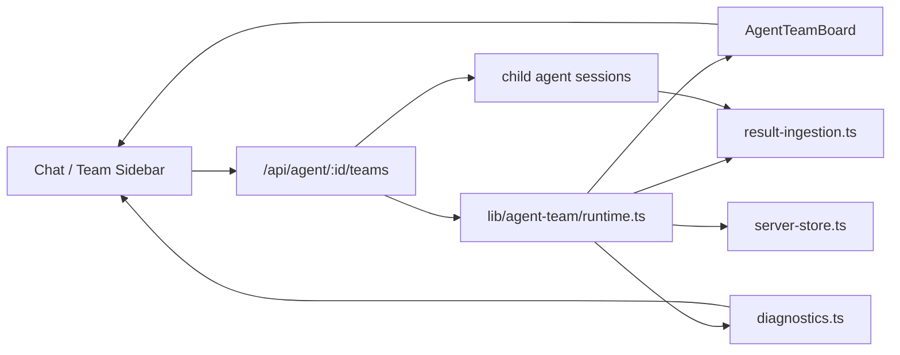
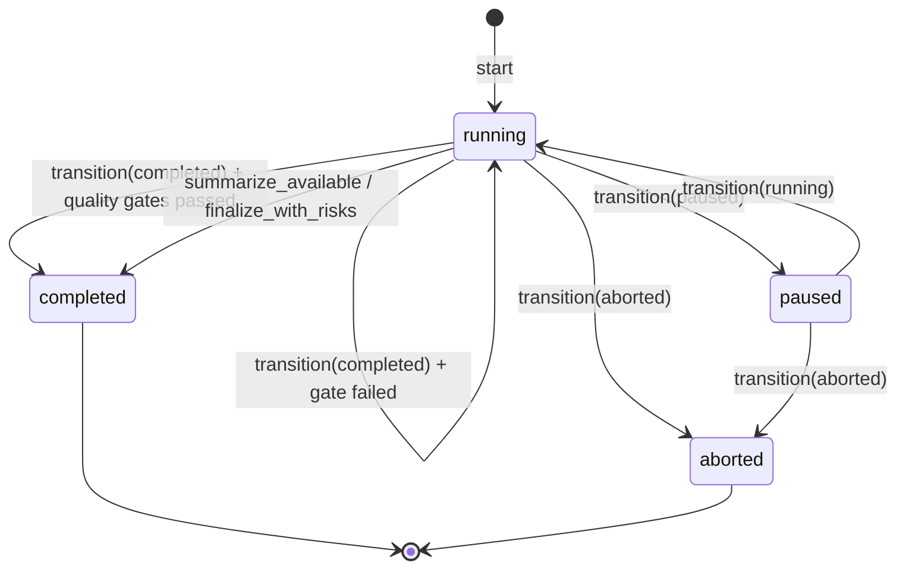
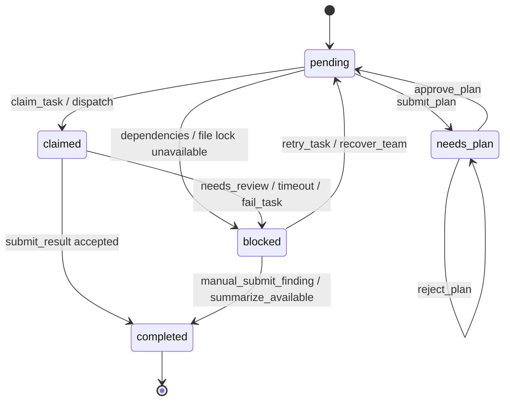
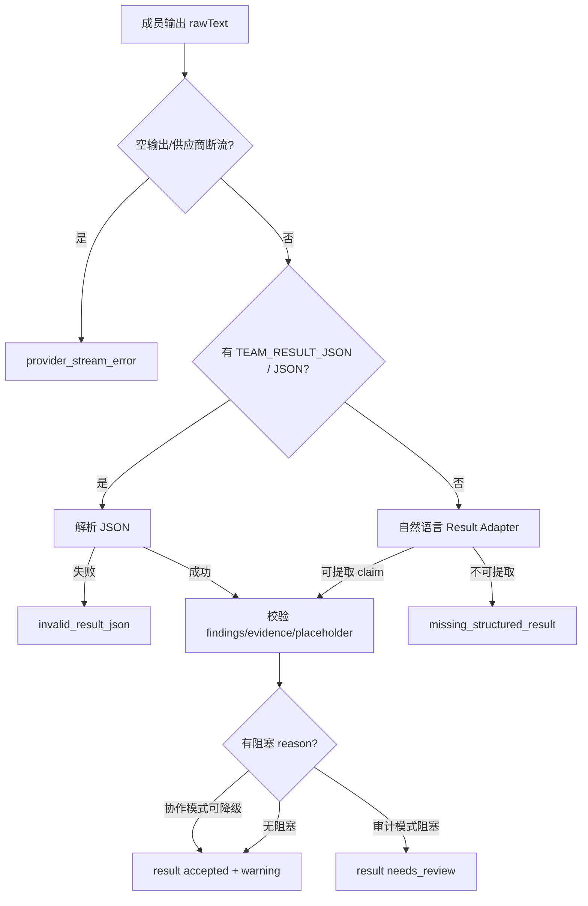

# Agent Team 状态图谱

状态：现状梳理（2026-06-22）

范围：`lib/agent-team/*`、`app/api/agent/[id]/teams/route.ts`、`app/components/MessageView.tsx`、`app/components/WorkbenchSidebar.tsx`。

这份文档记录当前代码里的真实状态机、校验门禁、诊断原因码和 UI 文案映射。它的目标不是设计下一版，而是作为后续修复和验收的“事实地图”。

## 1. 模块总览

| 模块 | 主要职责 | 关键文件 |
| --- | --- | --- |
| 类型层 | 定义 run/task/member/result/finding/challenge/gate/recovery 等状态枚举 | `lib/agent-team/types.ts` |
| 初始规划 | 生成初始成员、任务、hooks、quality gates、capability audit | `lib/agent-team/mock.ts`, `lib/agent-team/planner.ts` |
| 运行时 | 任务领取、结果入库、门禁、恢复、最终总结、状态转移 | `lib/agent-team/runtime.ts` |
| 结果整理 | 从结构化 JSON 或自然语言整理出 finding / challenge / warnings | `lib/agent-team/result-ingestion.ts` |
| 阻塞诊断 | 把 failed/blocked/needs_review 映射成标准 reason code | `lib/agent-team/diagnostics.ts` |
| API | Team start / run / recover / manual action / finalize 等动作入口 | `app/api/agent/[id]/teams/route.ts` |
| 聊天卡片 | 主消息区的 Team 卡片摘要、进度和基础动作 | `app/components/MessageView.tsx` |
| 右侧工作区 | Team board、成员、诊断、记录、人工干预入口 | `app/components/WorkbenchSidebar.tsx` |

## 2. Run 与 Lead 状态

### 2.0 Settings 与模式

| Setting | 可选值 | 当前默认 | 影响 |
| --- | --- | --- | --- |
| `mode` | `collaboration` / `audit` | `collaboration` | 决定 result ingestion 和 finalize 门禁松紧；协作模式允许 warning 收束，审计模式要求证据更严格。 |
| `memberScale` | `minimal` / `standard` / `large` | `standard` | 影响 planner 生成成员和任务规模。 |
| `displayMode` | `workspace` / `in_process` / `split_panes` | `workspace` | 类型层支持三种展示模式，当前主要 UI 是右侧 Team Workspace。 |
| `writePolicy` | `read_only` / `plan_approval` / `write_allowed` | `plan_approval` | 影响成员是否需要 plan approval 或允许写入。 |
| `networkPolicy` | `disabled` / `lead_only` / `teammates_allowed` | `disabled` | 影响联网能力分配。 |
| `worktreePolicy` | `none` / `per_member` / `per_task` | `none` | 非 none 时会生成 worktree gate，active/merge_pending worktree 阻止严格完成。 |
| `resultIngestionMode` | `structured` / `transcript_summary` | `structured` | 当前仍以结构化 board 为核心，但会通过 Result Adapter 接收自然语言。 |
| `coordinationProfile` | `none` / `basic` / `full` | `basic` | 影响 team_* 协作工具和审计轨迹能力。 |

### 2.1 Run 状态枚举

| Run status | 当前含义 | 主要进入路径 | UI 文案 |
| --- | --- | --- | --- |
| `draft` | 类型预留，当前 start 后直接 running | 枚举存在，当前主路径不主动创建 draft run | `待确认` |
| `running` | 团队正在推进或可继续推进 | `start`、`transition(running)`、finalize gate 失败回退 | `协作中` |
| `paused` | 用户暂停 | `transition(paused)` | `已暂停` |
| `finalizing` | 类型预留的综合中状态 | 枚举存在；当前 route 的 transition 白名单不接受 `finalizing` | `综合中` |
| `completed` | 团队已经最终收束 | `transition(completed)` gate 通过，或 `synthesizeAgentTeamFromAvailableWork` 强制收束后完成 | `已完成` |
| `failed` | 类型预留的失败态 | 枚举存在；当前 route 的 transition 白名单不接受 `failed` | `失败` |
| `aborted` | 用户停止团队 | `transition(aborted)`，释放 active file locks | `已中止` |

当前 API 允许的显式 transition 只有：`running`、`paused`、`completed`、`aborted`。

### 2.2 Lead 状态枚举

| Lead state | 当前含义 | 进入路径 | UI 文案 |
| --- | --- | --- | --- |
| `exploring` | 还在收集和分工 | 初始 run | `继续探索` |
| `needs_decision` | 有 challenge 或需要裁决 | 创建 challenge 时 | `需要裁决` |
| `ready_to_synthesize` | 已有 accepted finding，且关键任务可综合 | required tasks 完成并存在 accepted findings；record decision 也会设置 | `可综合` |
| `finalized` | 最终收束完成 | run completed | `已综合` |

### 2.3 Run 状态转移

关键一致性规则：

- `completed` 会同时设置 `leadState = "finalized"` 和 `endedAt`。
- `completed/aborted` 后，`diagnoseAgentTeamRun` 返回空数组；右侧 `需要你处理` 区域也被隐藏。仅 `leadState=finalized` 不会隐藏诊断。
- `transition(completed)` 不会强行通过。它先跑 `evaluateAgentTeamFinalize`，如果 blocking gate 失败，会保持 `running`、写入新的 `blockReasons`，并追加 `quality_gate_failed` 事件。
- `summarize_available` / `finalize_with_risks` 会调用 `synthesizeAgentTeamFromAvailableWork`，把未完成 required task 标记为 `lead_override` 完成，并用风险总结完成 run。

## 3. Task 状态机

| Task status | 当前含义 | 主要进入路径 | UI 文案 |
| --- | --- | --- | --- |
| `pending` | 可被自动分派 | 初始任务；retry/recovery 后；plan approve 后 | `待安排` / `待自动安排` |
| `needs_plan` | 等负责人审批 plan | `submitAgentTeamPlan` | `待计划审批` / `等负责人` |
| `claimed` | 已分配给成员，等待成员回写 | `claimAgentTeamTask`、dispatch | `已安排` / `处理中` |
| `running` | 类型和 UI 支持的进行中状态 | 当前 runtime 主路径较少直接写入，更多使用 `claimed` 表示已派发 | `进行中` / `处理中` |
| `blocked` | 任务被依赖、结果、锁、超时、格式等卡住 | dependency 不满足、file lock 冲突、needs_review、fail task、recovery 失败 | `阻塞` / `等待前置` |
| `completed` | 任务完成并纳入 board | `completeAgentTeamTask`、`synthesizeAgentTeamFromAvailableWork` | `完成` / `已处理` |

关键校验：

- `claimAgentTeamTask` 会先检查依赖；依赖未完成时把任务置为 `blocked`，blocker 为 `Waiting for dependencies`。
- 有 write paths 时会检查 file lock；冲突时任务和成员都会 blocked。
- `completeAgentTeamTask` 会跑 `TaskCompleted` hooks。blocking hook 失败时不会完成任务。
- `recoverStaleAgentTeamTasks` 会把超时的 `claimed/running` 任务回收到 `pending/blocked`，清 owner，并增加 retryCount。
- `blocked` task 不再直接进入自动分派队列；必须由 retry/recovery 显式恢复为 `pending` 后才能重新派发。
- `synthesizeAgentTeamFromAvailableWork` 可把未完成 required task 以 `completionSource = "lead_override"` 强制完成，用于“带风险总结”。

## 4. Member 状态

| Member status | 当前含义 | 进入路径 | UI 文案 |
| --- | --- | --- | --- |
| `idle` | 空闲，可接任务 | 初始成员、任务完成、retry/recovery 清 owner | `待安排` |
| `working` | 已领取任务 | `claimAgentTeamTask` | `工作中` |
| `blocked` | 成员因为任务阻塞、结果不可用、超时等停住 | `submit_result` needs_review、`failAgentTeamTask`、file lock 冲突 | `阻塞` |
| `done` | 类型预留 | 当前主路径很少使用 | `完成` |

成员恢复相关字段：

| 字段 | 含义 |
| --- | --- |
| `hydrateState = "ready"` | 重启后能恢复原 session |
| `hydrateState = "missing"` | 保存的 session 不可用，需要恢复或替换 |
| `hydrateState = "replaced"` | 已用新成员替换 |
| `failureCount` | 失败惩罚分会影响后续任务分派 |
| `currentTaskId` | 右侧“正在做什么”的主要来源之一 |
| `latestOutput` | 卡片说明和诊断摘要的主要来源之一 |

分派选择规则：

- 只从非 Lead 的 `idle` 成员里选，且需要有 `agentId`。
- 根据 task 文本和 member role 计算匹配分：综合任务偏 Synthesis/Lead，挑战任务偏 Critic/Validation，证据任务偏 Research/Validation。
- `failureCount` 越高，分数越低。

## 5. Result Ingestion 状态机

结果入库是当前 Agent Team 最容易出问题、也最关键的状态机。

| Result status | 含义 | 进入路径 |
| --- | --- | --- |
| `submitted` | 结果已入库且可用于 finding | `submitAgentTeamResult` 解析成功 |
| `needs_review` | 结果存在，但不可直接采纳 | invalid JSON、placeholder、缺 finding、审计模式缺 evidence 等 |
| `accepted` | 类型预留/历史兼容 | 当前主路径多使用 `submitted` + finding status |
| `rejected` | 被后续 adapter/recovery 替代或人工拒绝 | recovery adapter 成功时会把旧 needs_review 标为 rejected |

协作模式和审计模式差异：

| 场景 | 协作模式 | 审计模式 |
| --- | --- | --- |
| 自然语言无 JSON，但能提取 claim | 允许入库，source=`adapter`，带 warning | 允许整理，但缺证据会阻塞 |
| finding 缺 evidenceRefs | warning，不阻塞最终风险总结 | `needs_review`，推荐补证据 |
| provider stream error / 空输出 | 不当作真实结果，进入诊断或风险总结 | 同样不能通过严格门禁 |
| placeholder 模板内容 | 阻塞，防止把模板当发现 | 阻塞 |

## 6. Finding / Challenge / Decision

### 6.1 Finding

| Finding status | 含义 | 进入路径 | UI 文案 |
| --- | --- | --- | --- |
| `proposed` | 成员提出，尚未采纳 | result accepted 后自动创建 | `待确认` / `待判断` |
| `accepted` | 已纳入决策 | `accept_finding`，或 synthesis result 自动采纳 | `已采纳` / `已纳入` |
| `challenged` | 被 challenge 指向 | `create_challenge` | `有疑问` / `核对中` |
| `rejected` | 被拒绝 | `reject_finding` | `未采纳` / `已放弃` |

### 6.2 Challenge

| Challenge status | 含义 | 进入路径 | UI 文案 |
| --- | --- | --- | --- |
| `open` | 等处理 | result 里有 challenges，或手动 create | `待处理` |
| `needs_evidence` | 类型和诊断支持，表示需要补证据 | 当前主路径较少主动设置 | `需要证据` |
| `resolved` | 已解决 | `resolve_challenge` | `已解决` |
| `dismissed` | 被忽略/带风险收束 | `dismiss_challenge`，或风险总结自动 dismiss | `已忽略` |

### 6.3 Decision

`recordAgentTeamDecision` 的硬规则：

- 必须有 `title` 和 `rationale`。
- `acceptedFindingIds` 至少包含一个当前 `accepted` finding。
- 必须有 `evidenceRefs` 或 `sourceResultIds`。
- 如果引用的 challenge 还处于 `open/needs_evidence`，不能记录 decision。
- 成功后 `leadState = "ready_to_synthesize"`，追加 `decision_recorded` 事件。

## 7. Plan / Hook / Quality Gate

### 7.1 Plan

| Plan status | 含义 | 任务影响 |
| --- | --- | --- |
| `submitted` | 成员提交执行计划，等待负责人 | 关联 task 进入 `needs_plan` |
| `approved` | 负责人批准 | 关联 task 回到 `pending` |
| `rejected` | 负责人拒绝 | 关联 task 保持 `needs_plan`，blocker 写入拒绝原因 |

### 7.2 Hooks

初始 run 默认有 3 个 hook：

| Hook rule | Trigger | Severity | 当前规则 |
| --- | --- | --- | --- |
| `required_task_needs_finding` | `TaskCompleted` | blocking | required task 完成时必须带 findingClaim |
| `task_needs_evidence` | `TaskCompleted` | warning | task 完成时 evidenceRefs 为空则 warning |
| `idle_requires_no_runnable_tasks` | `TeammateIdle` | warning | 有 runnable task 时不应判断 teammate idle |

Hook 失败会追加 `quality_gate_failed` 事件；blocking hook 会阻止 `completeAgentTeamTask`。

### 7.3 Quality Gates

| Gate | Blocking | 通过条件 |
| --- | --- | --- |
| `gate-required-tasks` | 是 | `stopConditions.requiredTasksComplete !== false` 时，所有 required task 都是 `completed` |
| `gate-open-challenges` | 是 | `stopConditions.noOpenBlockingChallenges !== false` 时，没有 `open/needs_evidence` challenge |
| `gate-lead-synthesis` | 是 | `stopConditions.leadFinalSynthesis !== false` 时，至少有可追溯 accepted finding，且有可追溯 decision |
| `gate-worktrees-merged` | 是 | worktree policy 启用时，没有 active/merge_pending worktree |

`evaluateAgentTeamFinalize` 会刷新这些 gate。普通 `transition(completed)` 需要所有 blocking gate 通过；风险总结路径会先补一个 fallback finding / decision，再完成。

## 8. 阻塞诊断 reason codes

`diagnoseAgentTeamRun` 只在 run 未 completed/aborted 时输出诊断。它扫描 `needs_review` result、`blocked` task/member、open challenge、pending worktree、failed quality gate。

| Code | 触发来源 | 用户说明 | 推荐动作 | UI 标题 |
| --- | --- | --- | --- | --- |
| `missing_structured_result` | 成员有回复但未整理成 finding，或文本不可提取 | 成员回复还未整理成团队发现。 | 先自动整理成员回复；失败后重派或人工补充。 | 成员结果待整理 |
| `invalid_result_json` | JSON 解析失败或截断 | 成员提交的结构化结果格式不完整。 | 自动修复 JSON；失败后让成员只整理上一条回复。 | 结构化结果格式错误 |
| `missing_findings` | result 没有 findings | 结果里没有可采纳发现。 | 自动整理自然语言；失败后人工补发现或带风险总结。 | 缺少可采纳发现 |
| `missing_evidence` | finding 缺 evidenceRefs | 发现缺少证据引用。 | 协作模式可 warning；审计模式补证据。 | 缺少证据引用 |
| `placeholder_result` | 模板占位内容被提交 | 成员提交像模板占位，不是真实结果。 | 重派任务或让成员重写。 | 结果像是模板占位 |
| `member_unavailable` | session 丢失或 member 不可用 | 成员会话不可用。 | 恢复或换人。 | 成员会话不可用 |
| `member_timeout` | claimed/running 过期或文本含 timeout | 成员执行超时。 | 重试、换人、降低任务范围。 | 成员执行超时 |
| `task_dependency_waiting` | 依赖未完成 | 任务还在等前置结果。 | 先推进前置任务。 | 等待前置任务 |
| `open_challenge` | challenge open / needs_evidence | 还有分歧没有处理。 | 解决、关闭，或带风险总结。 | 还有分歧未处理 |
| `quality_gate_failed` | finalize gate 失败 | 结束条件未满足。 | 查看未满足项；补齐或带风险总结。 | 结束条件未满足 |
| `worktree_pending` | worktree active / merge_pending | 成员改动区还没处理。 | merge、保留或清理。 | 改动区未处理 |
| `provider_stream_error` | 模型流提前结束、finish_reason 缺失 | 模型连接提前结束。 | 重试、换模型，或把现有内容整理成风险总结。 | 模型连接提前结束 |

## 9. Recovery Engine

恢复入口：

- API：`recover_team`
- 自动调用点：`run_next`、`run_batch`、`run_until_idle` 前后会运行 blocked/stale recovery。
- UI：阻塞诊断和 task card 上的“自动整理”“让模型重试”“重派任务”等按钮。

当前恢复顺序：

1. 先跑 `diagnoseAgentTeamRun` 找标准 reason。
2. 对 `missing_structured_result / missing_findings` 优先尝试 `normalizeAgentTeamResult` adapter。
3. Adapter 成功：旧 result 标为 `rejected`，整理后的 result 重新 submit，task 可从 blocked 进入 completed。
4. Adapter 失败或其他可恢复 reason：在未超过 maxAttempts 时把任务回到 `pending/blocked`，清 owner，成员回 idle。
5. 仍失败：保留标准 reason code，等待人工补 finding、重派、换人或带风险总结。

防无限循环：

- `maxAttempts` 默认 2。
- 每次恢复写入 `recoveryAttempts`，包含 reasonCode、action、status、startedAt、endedAt、error。

## 10. API 动作到状态变化

| API action | 主要效果 |
| --- | --- |
| `start` | 创建 run、成员、任务、hooks、gates；写入聊天 user message；推送 `agent_team_run_start` |
| `resume` | 重建缺失 teammate session，更新 hydrate 状态 |
| `transition` | pause/resume/complete/abort；complete 会先跑 quality gates |
| `run_next` | 恢复 stale/blocked，分派一个可运行 task |
| `run_batch` | 并行分派多个 task |
| `run_until_idle` | 多轮分派直到没有可运行任务或达到轮次上限 |
| `claim_task` | 任务 pending -> claimed；成员 idle -> working；可能因依赖/锁 blocked |
| `complete_task` | 跑 hooks，通过后 task -> completed，成员 -> idle |
| `submit_result` | result ingestion；成功创建 findings/challenges，失败进入 needs_review/blocked |
| `diagnose_team` | 返回 blockReasons / recommendedActions |
| `recover_team` | 触发 adapter / retry / recovery attempts |
| `manual_submit_finding` | 人工补一条 finding，走 submit_result 入库 |
| `skip_task_with_reason` | 用现有结果强制风险总结 |
| `finalize_with_risks` | 同上，带风险收束 |
| `summarize_available` | 用当前已有 findings/results 生成最终综合 |
| `repair_result` | 对某 result 关联 task 发起 retry |
| `replace_member` | 将 member 标记为 replaced 并可重派任务 |
| `follow_up_member` | 给成员 session 追问，并把回复记录回 Team mailbox |
| `send_message` | 写 Team mailbox |
| `accept_finding` / `reject_finding` | 更新 finding 状态 |
| `create_challenge` / `resolve_challenge` / `dismiss_challenge` | 更新 challenge 与关联 finding |
| `record_decision` | 记录可追溯决策，更新 leadState |
| `submit_plan` / `approve_plan` / `reject_plan` | 计划审批状态和 task needs_plan/pending |
| `configure_hook` | 启停 hook 或调整 severity |

## 11. UI 显示映射

### 11.1 主聊天 Team 卡片

位置：`MessageView.tsx` 的 `AgentTeamRunPart`。

| 数据 | UI 表达 |
| --- | --- |
| `run.status` | `协作中 / 已暂停 / 综合中 / 已完成 / 失败 / 已中止` |
| `run.leadState` | `继续探索 / 需要裁决 / 可综合 / 已综合` |
| open challenge > 0 | 卡片摘要：`需要你确认` |
| blocked task > 0 | 卡片摘要：`团队在等前置结果` |
| working task mention structured teammate result | 卡片摘要：`等待成员返回证据` |
| open tasks > 0 | 卡片摘要：`团队正在自动推进` |
| no open tasks | 卡片摘要：`可以生成总结` |
| 非终态 | 显示 `查看过程`、`暂停/继续`、`生成总结`、`停止` |

### 11.2 右侧 Team Workspace

位置：`WorkbenchSidebar.tsx` 的 `AgentTeamWorkspace`。

| 区域 | 数据来源 | 当前用户文案 |
| --- | --- | --- |
| 顶部状态 | run objective/status | `团队协作` + status badge |
| 重启恢复 banner | hydrate missing/replaced members | `重启后还有 N 位 teammate 需要恢复` |
| 自动推进摘要 | challenge/blocked/working/pending/required completion | `团队正在自动协作`、`团队正在自动处理阻塞` 等 |
| 团队现在在做什么 | working members + open tasks | 当前 task、owner、latestOutput |
| 最近执行 | last 5 board events | `任务已分配`、`成员提交结果` 等 |
| 需要你处理 | open challenge / blocked task / submitted plan / failed gate | completed/aborted 时隐藏 |
| 阻塞诊断 | `run.blockReasons` | 标准 reason + 推荐动作 + recover/finalize 按钮 |
| 查看团队过程 | board tasks/members/results/findings/challenges/decisions | 详细 board |
| 成员分工 | `run.members` | 成员状态、查看记录、追问 |
| 成员记录 | active member transcript | 可打开完整记录，可提交到 Team board |

### 11.3 事件文案

| Event type | UI 文案 |
| --- | --- |
| `team_created` | 团队已创建 |
| `member_spawned` | 成员已启动 |
| `member_status_changed` | 成员状态更新 |
| `task_created` | 任务已创建 |
| `task_claimed` | 任务已分配 |
| `task_blocked` | 任务遇到阻塞 |
| `task_retried` | 任务已重试 |
| `task_unblocked` | 任务恢复推进 |
| `task_completed` | 任务已完成 |
| `result_submitted` | 成员提交结果 |
| `finding_proposed` | 提出发现 |
| `finding_accepted` | 发现已采纳 |
| `finding_rejected` | 发现未采纳 |
| `finding_challenged` | 发现被质疑 |
| `challenge_resolved` | 质疑已解决 |
| `decision_recorded` | 记录判断 |
| `message_sent` | 团队消息 |
| `quality_gate_failed` | 质量门禁未通过 |
| `team_finalized` | 团队已总结 |
| `team_aborted` | 团队已停止 |

类型层还定义了 `challenge_dismissed`、`plan_submitted`、`plan_approved`、`plan_rejected`、`member_promoted`、`member_replaced`、`worktree_created`、`worktree_failed`、`worktree_cleaned`、`worktree_merged`、`file_lock_acquired`、`file_lock_released`、`team_paused`、`team_resumed`。当前 `teamEventUserText` 没有逐个专门翻译这些事件，UI 会把下划线替换为空格后展示原始事件名。

### 11.4 Capability audit 状态

| Capability status | 含义 |
| --- | --- |
| `implemented` | 当前 run 中该能力已被证明可用或已触发 |
| `partial` | 能力部分具备，但有缺口 |
| `planned` | 已规划但还没有实证 |
| `blocked` | 当前 run 中该能力被阻断 |

初始 capability audit 会覆盖共享任务列表、mailbox、独立 teammate、直接交互、quality hooks、challenge lifecycle、decision traceability、automatic dispatch、file locking、shutdown cleanup、failure recovery。右侧 Workspace 的诊断区会展示这些能力的摘要。

## 12. 当前一致性规则

这些规则是后续测试最应该守住的部分：

1. `completed` 或 `aborted` 后，不应再显示 `blockReasons` 和“需要你处理”；仅 `leadState=finalized` 不能隐藏诊断。
2. 普通完成必须通过 blocking quality gates；否则 run 保持 `running`。
3. 风险总结路径允许完成，但必须把未完成项写成风险，不能伪装成全部成功。
4. 成员空输出或 provider stream error 不能被整理成真实 finding。
5. 自然语言结果可以由 adapter 整理成 finding；协作模式允许缺 evidence warning，审计模式不能放行缺 evidence。
6. Decision 必须可追溯到 accepted finding，并有 evidenceRefs 或 sourceResultIds。
7. Open / needs_evidence challenge 会阻止严格 finalize；`audit` 模式下 synthesis 不会自动 resolve open challenges。
8. Active / merge_pending worktree 在 worktree policy 启用时会阻止 finalize。
9. blocked task 必须有 blocker/lastError 或 blockReason，UI 才能给出可操作说明。
10. “查看记录”依赖 member 的 `sessionFile`；没有 sessionFile 时只能展示已保存摘要，不应假装可打开完整 transcript。

## 13. 当前容易误解的状态

| 现象 | 真实原因 |
| --- | --- |
| 已完成后还看到历史“阻塞诊断” | 当前已修正为 completed/aborted 时诊断为空，UI 也隐藏 attention；如果只是 leadState finalized 但 run 仍 running，会继续显示诊断。 |
| task 有 `running` 状态但多数显示 `claimed` | 类型和 UI 支持 `running`，但当前 Team runtime 分派后主要用 `claimed` 表示“已安排、等待成员回写”。 |
| challenge 有 `needs_evidence` 但很少出现 | 诊断和 UI 支持该状态，当前创建 challenge 默认是 `open`。 |
| run 有 `finalizing/failed` 但 API 不接受 transition | 类型和 UI 预留，当前 route 显式 transition 白名单只有 running/paused/completed/aborted。 |
| 成员自然语言输出没有 JSON 仍能完成 | Result Adapter 会尝试从自然语言里提取 finding/evidence/challenge；这是当前可靠化方向。 |
| “internal error” 比较泛 | 多数情况下是 API action 抛错或 provider stream 异常没有被映射到 Team reason code；应优先查看 server log 和 `blockReasons`。 |

## 14. 建议验收用例

| Case | 预期 |
| --- | --- |
| 标准协作成功 | required tasks 完成，至少一个 accepted finding，一个 traceable decision，run completed，右侧无阻塞诊断。 |
| 成员只输出自然语言 | adapter 生成 finding；协作模式可 warning 继续。 |
| 成员输出为空或断流 | 标记 `provider_stream_error`，不能生成真实 finding。 |
| 缺 evidenceRefs | 协作模式 warning，审计模式 blocked。 |
| open challenge | 协作模式可带风险总结；严格完成前必须 resolve/dismiss。 |
| completed 后刷新 | 仍显示 completed/finalized，不出现“需要处理”阻塞卡；running + finalized 的异常组合仍要显示诊断。 |
| 点击查看记录 | 有 sessionFile 的成员能打开 transcript；没有时 UI 应说明只有摘要。 |
| 自动整理失败 | 显示“成员结果待整理”，提供自动整理、重派、人工补充、带风险总结。 |
| summarize_available | 未完成 required task 被 lead_override 完成，最终结论明确写风险。 |
| worktree active | worktree policy 启用时 finalize 被 gate 阻止。 |
