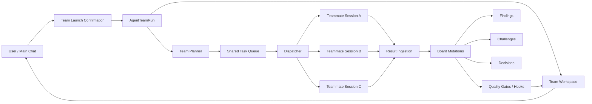

# Agent Team 成熟化技术方案

日期：2026-06-21

状态：Draft for review

目标：把当前 Beta / 技术预览版 Agent Team 补齐到接近 Claude Agent Teams 成熟体验的可验证闭环。本文只做技术方案，不执行代码实现。

参考：

- 官方基线：https://code.claude.com/docs/en/agent-teams
- 当前审计：`docs/audit/agent-team-maturity-audit-2026-06-21.md`

## 1. 背景与问题

当前 Agent Team 已具备 Team run card、Team Workspace、隐藏 teammate session、board、mailbox、file locks、run_next/run_batch/run_until_idle、retry/replace、持久化等基础能力。

但审计结论是：**能力维度基本对标，成熟度不足**。主要缺口是：

1. `run_next/run_until_idle` 是半自动调度，prompt 成功后直接模板化 complete task，没有真实解析 teammate 产出。
2. `challenge / decision` 主要停留在结构与展示层，缺少 create/resolve/accept/reject/record 的行为闭环。
3. 启动设置里的 `memberScale / allowNetwork / allowWrite / allowWorktree / allowChallenges / requirePlanApproval` 主要被保存，未强约束运行时。
4. 缺少覆盖真实用户路径的 E2E 验收链路。

## 2. 成熟化目标

### 2.1 产品目标

成熟版 Team 应满足：

- Team 不是“更多 subagents”，而是共享任务板 + 成员互相通信 + 挑战收敛 + 可追溯决策。
- 用户能信任 Team board：任务状态、finding、challenge、decision 都来自真实 teammate 产出或明确的人为操作。
- 启动设置是真实约束，不是装饰性选项。
- 失败、暂停、恢复、重试和 finalize 都有可解释状态。

### 2.2 工程目标

实现以下闭环：

1. Real teammate result ingestion
   - 调度后不再 prompt 成功即完成。
   - 读取或接收 teammate 真实产出。
   - 结构化抽取 findings / evidence / challenges / follow-up needs。
   - 只有结构化产出满足 hooks/gates 时才 complete task。

2. Challenge and decision lifecycle
   - 支持 create_challenge / resolve_challenge / dismiss_challenge。
   - 支持 accept_finding / reject_finding。
   - 支持 record_decision，并强制 decision 绑定 findings/challenges/evidence。

3. Runtime settings enforcement
   - memberScale 影响 members/tasks。
   - allowWrite / allowNetwork / allowWorktree 影响 child agents 的工具权限、write boundary、worktree strategy。
   - allowChallenges 控制 challenge 创建。
   - requirePlanApproval 启用 plan approval 状态机。

4. E2E acceptance
   - 覆盖 `/team` 启动、确认、workspace、dispatch、真实 ingestion、challenge、resolve、decision、finalize。

## 3. 设计原则

1. Board 是权威协作状态，不是 transcript 摘要缓存。
2. Transcript 是证据来源，不是主流程状态。
3. 所有可见结论必须有 provenance。
4. Team 设置必须影响 runtime 行为。
5. 不把未验证的 teammate prompt 成功误判为 task complete。
6. 先实现最小成熟闭环，再扩展更复杂的 planner / worktree / hooks。

## 4. 目标架构



新增核心模块：

- `lib/agent-team/planner.ts`
- `lib/agent-team/result-ingestion.ts`
- `lib/agent-team/coordination-tools.ts`
- `lib/agent-team/permissions.ts`
- `lib/agent-team/worktree-policy.ts`
- `lib/agent-team/e2e-fixtures.ts` 或测试 helper

## 5. 数据结构扩展

### 5.1 Task 扩展

当前：

- `AgentTeamTask.status`
- `ownerAgentId`
- `findingIds`
- `dependsOnTaskIds`

建议新增：

```ts
interface AgentTeamTask {
  assignedAgentId?: string;
  planId?: string;
  resultId?: string;
  claimedByToolCallId?: string;
  completionSource?: "manual" | "teammate_result" | "lead_override";
  expectedOutput?: "findings" | "review" | "implementation" | "plan" | "decision_input";
  acceptanceCriteria?: string[];
  evidenceRequired?: boolean;
  maxAttempts?: number;
}
```

设计意图：

- 区分 assigned 与 claimed。
- 区分 task completion 是真实 teammate result 还是 manual override。
- 让 hooks/gates 有明确标准。

### 5.2 Teammate Result

新增：

```ts
interface AgentTeamResult {
  id: string;
  taskId: string;
  authorAgentId: string;
  sessionFile?: string;
  rawText: string;
  summary: string;
  parsedAt: number;
  status: "parsed" | "needs_review" | "rejected";
  findingIds: string[];
  challengeIds: string[];
  evidenceRefs: string[];
  parseWarnings: string[];
}
```

写入 `AgentTeamBoard.results`。

用途：

- 保存 teammate 真实产出快照。
- 让 finding/challenge 能追溯 raw result。
- 避免只靠 session file 这种弱 evidence。

### 5.3 Finding 扩展

建议新增：

```ts
interface AgentTeamFinding {
  sourceResultId?: string;
  acceptedByAgentId?: string;
  acceptedAt?: number;
  rejectedByAgentId?: string;
  rejectedAt?: number;
  rejectionReason?: string;
  provenance: Array<{
    kind: "result" | "session" | "artifact" | "file" | "message";
    ref: string;
    quote?: string;
  }>;
}
```

### 5.4 Challenge 扩展

当前 challenge 可以表示状态，但缺少 lifecycle metadata。

建议新增：

```ts
interface AgentTeamChallenge {
  sourceResultId?: string;
  createdAt: number;
  resolvedAt?: number;
  resolvedByAgentId?: string;
  resolutionFindingIds?: string[];
  requiredEvidenceRefs?: string[];
}
```

### 5.5 Decision 扩展

建议新增：

```ts
interface AgentTeamDecision {
  status: "draft" | "accepted" | "superseded";
  challengeIds: string[];
  evidenceRefs: string[];
  sourceResultIds: string[];
  confidence: "low" | "medium" | "high";
}
```

Finalize gate 应要求：

- 至少一个 accepted decision。
- final decision 引用至少一个 accepted finding。
- 不存在 open / needs_evidence challenge。

### 5.6 Plan Approval

新增：

```ts
interface AgentTeamPlan {
  id: string;
  taskId: string;
  authorAgentId: string;
  body: string;
  status: "requested" | "submitted" | "approved" | "rejected";
  submittedAt?: number;
  reviewedAt?: number;
  reviewedByAgentId?: string;
  rejectionReason?: string;
  criteria: string[];
}
```

写入 `AgentTeamBoard.plans`。

### 5.7 Settings 扩展

现有 settings 保留，新增 policy detail：

```ts
interface AgentTeamSettings {
  writePolicy: "read_only" | "plan_approval" | "write_allowed";
  networkPolicy: "disabled" | "lead_only" | "teammates_allowed";
  worktreePolicy: "none" | "per_member" | "per_task";
  resultIngestionMode: "structured" | "transcript_summary";
}
```

兼容映射：

- `allowWrite=false` -> `writePolicy=read_only`
- `allowWrite=true && requirePlanApproval=true` -> `writePolicy=plan_approval`
- `allowWrite=true && requirePlanApproval=false` -> `writePolicy=write_allowed`
- `allowNetwork=false` -> `networkPolicy=disabled`
- `allowWorktree=true` -> `worktreePolicy=per_member`

## 6. Runtime 行为改造

### 6.1 Dynamic Team Planning

新增 `createPlannedAgentTeamRun(objective, settings)` 替换固定 mock 初始化。

阶段一可以先做 deterministic planner，不引入模型调用：

| memberScale | 成员数 | 默认角色 |
| --- | --- | --- |
| small | 3 | Lead, Research, Critic |
| standard | 5 | Lead, Research, Critic, Builder/Investigator, Synthesis |
| deep | 8+ | Lead + Research shards + Critics + Synthesis + Test/Validation |

任务生成规则：

- 所有 Team 都有 frame / evidence / challenge / synthesis。
- 如果 allowWrite=true，增加 implementation-plan 或 implementation task。
- 如果 requirePlanApproval=true，写入类 task 初始 expectedOutput=plan，且需要 approved plan 才能 claim implementation。
- 如果 allowChallenges=false，不生成 required challenge task，finalize gate 不要求 challenge lifecycle。

阶段二再引入模型 planner，让 lead 动态生成 members/tasks。

### 6.2 Dispatch 不再直接 complete

当前流程：

1. plan dispatch
2. prompt teammate
3. prompt 成功
4. complete task with template finding

目标流程：

1. plan dispatch
2. claim task
3. prompt teammate，要求输出结构化 block
4. teammate 完成后通过以下之一回写：
   - preferred：teammate coordination tool 调用 `team_submit_result`
   - fallback：读取 teammate 最新 assistant message，解析结构化 result
5. `ingestAgentTeamResult`
6. hooks/gates 通过后 complete task
7. 若解析失败或证据不足，task -> blocked / needs_review

### 6.3 Result Ingestion Contract

给 teammate 的 prompt 必须要求输出结构化 JSON block，例如：

```text
TEAM_RESULT_JSON:
{
  "summary": "...",
  "findings": [
    {
      "claim": "...",
      "confidence": "high",
      "evidenceRefs": ["file:...", "session:...", "artifact:..."]
    }
  ],
  "challenges": [
    {
      "targetFindingId": "...",
      "reason": "...",
      "severity": "medium",
      "requiredEvidenceRefs": []
    }
  ],
  "needsFollowUp": []
}
```

解析策略：

- 优先解析 JSON fenced block。
- JSON 不合法时保存 rawText，result.status=needs_review，task blocked。
- finding 缺 evidence 时按 hook severity 处理。
- 如果 allowChallenges=false，忽略 teammate challenges 并记录 warning。

### 6.4 Teammate Coordination Tools

给 child agent 注册 Team 专用工具或 extension：

- `team_get_board`
- `team_claim_task`
- `team_submit_result`
- `team_send_message`
- `team_create_challenge`
- `team_resolve_challenge`
- `team_request_plan_approval`

实现方式建议：

- 初期用 agent extension 包装 tool_call / custom tool registry，如果当前 SDK 支持本地工具注册，优先注册真实 tool。
- 若当前 SDK 不便注册工具，先在 prompt contract + server ingestion fallback 落地，但设计上保留工具接口。

成熟标准：

- teammate 可以自己 claim next unblocked task。
- teammate 可以给另一个 teammate 发 message。
- teammate result 能直接更新 board。

### 6.5 Challenge Lifecycle

新增 runtime functions：

- `createAgentTeamChallenge(run, opts)`
- `resolveAgentTeamChallenge(run, challengeId, opts)`
- `dismissAgentTeamChallenge(run, challengeId, opts)`
- `acceptAgentTeamFinding(run, findingId, opts)`
- `rejectAgentTeamFinding(run, findingId, reason, opts)`

新增 API action：

- `create_challenge`
- `resolve_challenge`
- `dismiss_challenge`
- `accept_finding`
- `reject_finding`

Workspace 增加操作：

- finding card 上有 accept / reject / challenge。
- challenge card 上有 resolve / dismiss / request evidence。
- unresolved challenge 阻止 finalize。

### 6.6 Decision Lifecycle

新增 runtime function：

- `recordAgentTeamDecision(run, opts)`
- `supersedeAgentTeamDecision(run, decisionId, opts)`

新增 API action：

- `record_decision`
- `supersede_decision`

Decision 约束：

- decision 至少引用一个 accepted finding。
- 如果引用 rejected finding，必须写 rationale。
- final decision 必须引用所有 blocking challenge 的 resolution 或明确 dismiss rationale。

Workspace 增加：

- Decisions section 支持 Record decision。
- 点击 decision 展示 linked findings/challenges/evidence。

### 6.7 Plan Approval State Machine

当 `settings.writePolicy=plan_approval`：

1. write/implementation task 先进入 `needs_plan` 或使用 `AgentTeamPlan.status=requested`。
2. teammate 只能 submit plan。
3. lead 审核：
   - approve -> task 可进入 implementation
   - reject -> plan rejected，task 回到 plan revision
4. 写工具调用前检查：
   - 没 approved plan -> block
   - approved plan 不含该 write path -> warning 或 block，取决于 settings

新增 API：

- `submit_plan`
- `approve_plan`
- `reject_plan`

Workspace：

- Plans section。
- task card 显示 plan status。

### 6.8 Permissions Enforcement

新增 `createAgentTeamPolicyExtension`，和现有 file lock extension 同级安装到 child agents。

检查点：

- 写工具：
  - `allowWrite=false`：block all write-like tools。
  - `writePolicy=plan_approval`：没有 approved plan 时 block。
  - `writePolicy=write_allowed`：允许，但仍经过 file lock。
- 网络工具：
  - `networkPolicy=disabled`：block browser/network/search/fetch-like tools。
  - `lead_only`：child block，lead allow。
- worktree：
  - `worktreePolicy=per_member`：spawn teammate 时使用 member worktree cwd。
  - 如果 worktree 创建失败：member blocked，并写 event。

需要复用：

- `lib/subagents/write-boundary.ts` 的 write target extraction。
- `lib/workflows/git-worktree` 或现有 worktree manager。

### 6.9 Worktree Strategy

MVP：

- `allowWorktree=false`：所有 teammate 在同 cwd，依靠 file locks 防冲突。
- `allowWorktree=true`：每个 write-capable teammate 创建 per-member worktree。

数据结构：

```ts
interface AgentTeamMember {
  worktree?: {
    id: string;
    path: string;
    branchName: string;
    status: "active" | "merge_pending" | "merged" | "failed" | "cleaned";
  };
}
```

后续：

- Workspace 显示 worktree 状态。
- Finalize 前提示 merge / cleanup。

## 7. API 设计

现有 endpoint 保持：`POST /api/agent/[id]/teams`

新增 actions：

```ts
type AgentTeamAction =
  | "submit_result"
  | "create_challenge"
  | "resolve_challenge"
  | "dismiss_challenge"
  | "accept_finding"
  | "reject_finding"
  | "record_decision"
  | "submit_plan"
  | "approve_plan"
  | "reject_plan";
```

建议把 route 拆分：

- `app/api/agent/[id]/teams/route.ts` 保持薄路由。
- `lib/agent-team/actions.ts` 处理 action parsing。
- `lib/agent-team/runtime.ts` 只处理 pure state transitions。
- `lib/agent-team/dispatcher.ts` 处理 createAgent / prompt / ingestion。

原因：当前 route 已经承担太多 orchestration，继续堆 action 会难维护。

## 8. UI / UX 改造

### 8.1 Launch Confirmation

保留现有确认面板，改进：

- 成员规模旁显示实际将创建的成员列表。
- 写入/网络/worktree 勾选旁显示实际 enforcement 文案。
- requirePlanApproval 开启时，明确“teammate 写入前必须先提交 plan”。

### 8.2 Team Workspace

新增/强化：

- Results tab/section：显示真实 teammate result、parse status、raw snapshot。
- Plans section：显示 submitted/approved/rejected plans。
- Findings 操作：accept / reject / challenge。
- Challenges 操作：resolve / dismiss / request evidence。
- Decisions 操作：record decision / view provenance。
- Policy panel：显示 write/network/worktree policy 是否已 enforced。

### 8.3 Team Run Card

新增指标：

- needs review results
- open plans
- rejected findings
- policy blocks

卡片状态：

- 如果有 `needs_review` result，不应显示 ready_to_synthesize。
- 如果 open challenge > 0，不可显示 completed。

## 9. E2E 验收方案

### 9.1 Unit Tests

新增：

- result ingestion parser
- submit_result -> finding/challenge creation
- accept/reject finding
- create/resolve/dismiss challenge
- record_decision traceability gates
- settings -> policy mapping
- writePolicy blocks write without plan
- networkPolicy blocks network tool
- memberScale changes members/tasks

### 9.2 Integration Tests

新增 route-level tests：

- start with memberScale small/standard/deep
- submit_result via API and board updates
- unresolved challenge blocks finalize
- decision without accepted finding rejected
- plan approval controls write task completion

### 9.3 E2E Tests

建议 Playwright 覆盖：

1. `/team foo` -> confirmation -> Start Team。
2. Workspace opens, member count follows selected scale。
3. Run next dispatches task and creates result/finding from fixture teammate output。
4. User challenges a finding。
5. User resolves challenge with evidence。
6. Lead records final decision。
7. Finalize succeeds only after gates pass。
8. Promote teammate does not switch main session unless user chooses transcript。
9. Reload session restores board with results/challenges/decisions。

为了避免真实模型不稳定，E2E 可以使用 fixture agent 或 mock promptLocalCodingAssistantAgent 输出 deterministic `TEAM_RESULT_JSON`。

## 10. 分阶段实施计划

### Phase 1：State Machine and Data Model

目标：不接真实 UI，也先让 runtime 成熟。

改动：

- 扩展 types。
- 新增 result / plan / challenge / decision runtime mutations。
- 新增 unit tests。

验收：

- runtime tests 覆盖 all lifecycle。
- finalize gate 严格依赖 accepted finding + resolved challenges + accepted decision。

### Phase 2：Real Result Ingestion

目标：修正 prompt 成功即 complete。

改动：

- 新增 result-ingestion parser。
- dispatch 改为 submit/ingest result。
- fallback 读取 teammate latest output 或 fixture output。
- task 在 result 解析失败时 blocked/needs_review。

验收：

- run_next 不再模板化完成。
- fixture teammate output 能生成 finding/challenge。
- missing evidence 被 hook 捕获。

### Phase 3：Challenge / Decision API and Workspace

目标：把冲突和裁决做成真实操作。

改动：

- 新增 API actions。
- Workspace 增加 accept/reject/challenge/resolve/record decision。
- Team run card 增加 needs-review/open-challenge indicators。

验收：

- 用户能完整走 finding -> challenge -> resolve -> decision -> finalize。

### Phase 4：Policy Enforcement and Plan Approval

目标：让启动设置变成运行时边界。

改动：

- policy mapper。
- child agent policy extension。
- plan approval state machine。
- write/network tool blocking。
- memberScale planner。

验收：

- allowWrite=false 阻止 write tools。
- requirePlanApproval=true 时未批准 plan 不可写。
- memberScale 影响成员与任务。

### Phase 5：Worktree and E2E

目标：工程化可靠性。

改动：

- per-member worktree MVP。
- E2E fixture harness。
- reload/restore tests。

验收：

- 真实浏览器路径通过。
- restart/hydrate board 完整。
- stop 清理 hidden teammate 和 active locks/worktrees。

## 11. 风险与取舍

### 11.1 最大风险：teammate 输出不可稳定解析

缓解：

- 使用严格 `TEAM_RESULT_JSON` contract。
- 解析失败时不 complete task。
- 保留 raw result 和 needs_review 状态。

### 11.2 最大复杂度：权限 enforcement

缓解：

- 第一版先拦 write-like / network-like 工具。
- plan approval 只控制写入，不控制纯研究。
- worktree 作为 policy 单独阶段实现。

### 11.3 最大 UX 风险：Workspace 过载

缓解：

- 默认展示 Board + critical alerts。
- Results/Plans/Policy 折叠。
- 主聊天仍只显示 Team card summary。

## 12. 审查决策点

执行前需要确认：

1. Result ingestion 优先路线
   - A. 先做 prompt contract + transcript/latest-output parser。
   - B. 直接做 teammate coordination tools。
   - 推荐：A + 预留 B 接口。这样最快修掉 prompt 成功即 complete。

2. Dynamic planner 路线
   - A. deterministic planner。
   - B. model-based planner。
   - 推荐：先 A，后 B。当前核心问题是闭环，不是智能规划。

3. Worktree 范围
   - A. Phase 4 先只 enforcement，不建 worktree。
   - B. Phase 4 同时 per-member worktree。
   - 推荐：A。先把权限边界做可信，再做隔离工作区。

4. E2E harness
   - A. 用 fixture teammate output。
   - B. 用真实模型跑。
   - 推荐：A 为 CI，B 为人工验收。

5. UI 信息架构
   - A. 当前 Workspace 内增加 sections。
   - B. 做 tabs：Board / Results / Plans / Decisions / Policy。
   - 推荐：先 sections，成熟后再 tab 化。

## 13. Definition of Done

以下全部满足，才可以把 Agent Team 从 Beta 提升到 Mature candidate：

1. `run_next/run_until_idle` 不再模板化完成任务。
2. teammate 真实结果能落为 `AgentTeamResult`。
3. findings/challenges/decisions 都有 provenance。
4. unresolved challenge 阻止 finalize。
5. final decision 必须绑定 accepted finding。
6. allowWrite / allowNetwork / requirePlanApproval 至少对 child agent 工具调用有强约束。
7. memberScale 实际影响成员数。
8. E2E 覆盖完整 Team lifecycle。
9. typecheck、unit、integration、E2E 均通过。
10. 审计报告更新，成熟度从 Beta 进入 Mature candidate。

