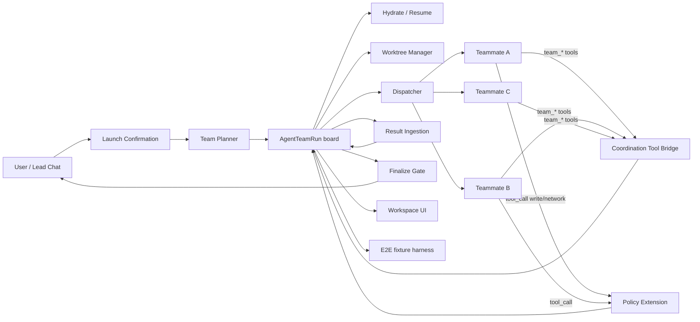

# Agent Team 可交付闭环技术方案

日期：2026-06-22
状态：Ready for review
对标基线：https://code.claude.com/docs/en/agent-teams
前序文档：
- 审计：`docs/audit/agent-team-maturity-audit-2026-06-21.md`
- 上一版方案：`docs/plans/2026-06-21-agent-team-maturity-technical-plan.md`（已完成 Phase 1–3 大部分）
- 系统形态：`docs/plans/2026-06-04-rfc-7-multi-agent-final-architecture.md`（subagent 终态）

## 0. TL;DR

Agent Team 已经从「Beta scaffold」升级到「行为基本接通」：
result ingestion、challenge / decision / finding mutation、policy enforcement、
plan approval state machine、Workspace 操作面板这五块都已落地。

但仍有四个**阻断"可交付"的硬缺口**：

1. teammate 仍然只能被 lead-side API 中心化驱动，没有 self-coordination tools。
2. `worktreePolicy` 只是字段，spawnInitialTeammates 不真做工作区隔离。
3. 重启后 teammate AgentRecord 不会被重建，dispatch 会 fallback 到 lead。
4. 端到端验证为零（`e2e/` 下无 team spec），无法证明前述链路在浏览器路径下成立。

本方案给出**面向交付**的闭环：六个 phase、明确数据/接口/UI 改动、可验证 DoD、回归矩阵。
执行完成后可以把 Agent Team 从 `experimental` 调整到 `mature candidate`，并在产品语言里
说"已支持 teammate 自主协作 + 受控写入隔离 + 完整恢复 + E2E 验收"。

## 1. 现状基线（2026-06-22 实测）

下表是对仓库实际代码的核对结果，作为本方案的起点。审计文档的判断已经过时的项，会用 ✅/⚠️/❌ 标出真实状态。

| 维度 | 6-21 审计判定 | 6-22 代码实测 | 状态 |
|---|---|---|---|
| dispatch 完成语义 | prompt 成功即完成 | `dispatchAgentTeamPlans` 已改为读取真实 raw text → `submitStoredAgentTeamResult` → `parseAgentTeamResultText`；解析失败强制 task `blocked / needs_review` | ✅ |
| Result ingestion contract | 不存在 | `lib/agent-team/result-ingestion.ts` 解析 `TEAM_RESULT_JSON` block，缺失/异常写 `parseWarnings` | ✅ |
| Finding accept/reject | 缺 mutation | `accept_finding / reject_finding` API + runtime + 事件 + UI 按钮（`WorkbenchSidebar.tsx`） | ✅ |
| Challenge lifecycle | 缺 mutation | `create_challenge / resolve_challenge / dismiss_challenge` API + UI；ingestion 自动从 parsed challenges 建 challenge | ✅ |
| Decision traceability | 静态展示 | `record_decision` 强制 `acceptedFindingIds + challengeIds + evidenceRefs + sourceResultIds + confidence`；finalize gate 检查 open challenge | ✅ |
| Plan approval 状态机 | 只有 setting | `submit_plan / approve_plan / reject_plan` API + `plan_submitted/approved/rejected` 事件 + `task.status=needs_plan` | ✅ |
| writePolicy / networkPolicy 强约束 | 装饰性 | `createAgentTeamPolicyExtension` 已挂在 child agent（`lib/agent-registry.ts:2020`），通过 `validateStoredAgentTeamToolPolicy` 实拦截 | ✅ |
| memberScale | 装饰性 | `createInitialAgentTeamRun` 已按 `small/standard/deep` 生成 3 / 5 / 7 成员 | ⚠️ 模板 |
| Initial planning | 固定 scaffold | 仍然不看 objective，只是按 settings 选模板 | ❌ |
| Teammate self-coordination tools | 缺 | 仓库零命中 `team_claim_task / team_submit_result / team_create_challenge` 等工具；teammate 只能被 lead-side API 驱动 | ❌ |
| Worktree 隔离 | 没做 | `worktreePolicy` 字段存在；`spawnInitialTeammates` 不调用任何 worktree 工具，所有 teammate 共享 cwd | ❌ |
| Resume 完整性 | running → paused | hydrate 已转 paused 保留 board；但 `member.agentId` 指向已不存在的 runtime，dispatch fallback 到 lead | ❌ |
| 用户自定义 hooks | 内置规则 | 仍然只有内置 `TaskCompleted / TeammateIdle`；`TaskCreated` 未真实评估 | ❌（保留 P2） |
| E2E | 缺 | `e2e/` 无 team spec | ❌ |

结论：**Phase 1–3（state machine、ingestion、challenge/decision/plan API + UI）已经完成**。剩下阻断「可交付」的是四个硬缺口（self-coordination tools、worktree 真实隔离、resume 重建、E2E）和一个软缺口（dynamic planner）。本方案聚焦于把这五项闭合。

## 2. 交付目标与不做的事

### 2.1 产品目标

交付后用户可以放心地说出以下三句话：

1. **Teammate 自己跑**：teammate 拿到任务后用工具自己 claim、提交结果、发起挑战、请求 plan 审批，不再「全靠 lead 戳一下走一步」。
2. **写代码 Team 不互相覆盖**：勾选 worktree 时每个 write-capable teammate 跑在独立 git worktree，最终 finalize 时由 lead 决定 merge 或丢弃。
3. **关闭 / 重启 / 重启浏览器都能续上**：重启后 paused team 可以恢复并自动重建 idle teammate session；丢失的 session 显式标「需替换」，不会静默错给 lead。

### 2.2 工程目标

本方案完成后必须满足的硬指标：

- typecheck、unit、integration、E2E 全绿。
- `lib/agent-team/` 新增模块：`coordination-tools.ts`、`worktree-policy.ts`、`hydrate.ts`、`planner.ts`。
- `e2e/10-agent-team.spec.ts` 覆盖完整 lifecycle（启动 → dispatch → ingestion → challenge → resolve → decision → finalize → reload）。
- 审计报告更新到 7.5–8 / 10，至少在「真实协作闭环」「权限、安全、冲突控制」「测试与验收证据」三项进入 8+。

### 2.3 显式不做

以下条目刻意排除在本次交付，避免 scope creep：

- 用户自定义 hooks DSL（保留 P2）。
- Split panes / 多 teammate transcript 并排视图（保留 P2）。
- LLM-based dynamic planner（本方案只做 deterministic planner v2，给后续模型 planner 留接口）。
- Nested teams / dynamic team scale-out（明确不支持）。
- 跨 session 的 team 共享。

## 3. 设计原则

1. **Board 是权威协作状态，transcript 是证据来源**。任何 task 完成必须 trace 到 result/finding/challenge/decision；任何写入必须 trace 到 approved plan。
2. **Teammate 工具优先，lead API 兜底**。所有 mutation 必须能被 teammate 自己调用；lead-side 同名 API 仅作 fallback 与人工干预通道。
3. **能拒绝就拒绝**。settings 是硬边界；读权限默认最小，越权直接 block 并写 event，不要靠 prompt 约束模型。
4. **可恢复 ≠ 可继续运行**。重启后 team 默认 paused，teammate session 默认重建为 idle，是否 resume 由用户显式触发。
5. **失败可见，不静默吞掉**。teammate 异常一律把 task 标 `blocked` 并写 event；从来不允许「prompt 调用失败 → 假装 task 完成」。
6. **隔离要么真做，要么显式不做**。`allowWorktree=true` 必须真建 worktree；建不出来就标 member 为 blocked，不要让用户以为有隔离。
7. **E2E 是 DoD，不是事后补充**。每一个 phase 落地时同步加 deterministic fixture 的 E2E 步骤。

## 4. 目标架构



模块清单（新增 / 改造）：

| 模块 | 角色 | 状态 |
|---|---|---|
| `lib/agent-team/coordination-tools.ts` | 注册 `team_*` 工具，转调 server-store mutation | 新增 |
| `lib/agent-team/coordination-bridge.ts` | 工具 → memberId 解析、审计、rate-limit | 新增 |
| `lib/agent-team/worktree-policy.ts` | per-member / per-task worktree 创建 / 合并 / 清理 | 新增 |
| `lib/agent-team/hydrate.ts` | 重启后重建 teammate session、分类 member 状态 | 新增 |
| `lib/agent-team/planner.ts` | deterministic planner v2，按 objective 模式选模板，留 LLM 接口 | 新增 |
| `lib/agent-team/policy-extension.ts` | 现有 policy 扩展，补 worktree path 检查 | 改造 |
| `lib/agent-team/server-store.ts` | 新增 `submitFromTeammate / requestPlanByTeammate` 等带身份校验的 mutation | 改造 |
| `lib/agent-registry.ts` | 注入 coordination tools 到 child agent | 改造 |
| `app/api/agent/[id]/teams/route.ts` | 拆出 dispatcher / actions，作 fallback 通道 | 改造 |
| `app/components/WorkbenchSidebar.tsx` | 加 worktree / hydrate 状态展示 | 改造 |
| `e2e/10-agent-team.spec.ts` | 完整 lifecycle E2E，使用 fixture teammate | 新增 |

## 5. 数据模型增量

以下是在现有 `AgentTeamRun / Member / Task` 上要加的字段。所有字段均可选，以保证向后兼容。

### 5.1 Member 增量

```ts
interface AgentTeamMember {
  worktree?: {
    id: string;
    path: string;            // 绝对路径
    branchName: string;
    baseRef: string;         // 创建时的 git ref
    status: "active" | "merge_pending" | "merged" | "failed" | "cleaned";
    createdAt: number;
    failureReason?: string;
  };
  // hydrate 后用于区分 “可重建” / “需替换” / “丢失”
  hydrateState?: "intact" | "rehydrated" | "missing" | "replaced";
  toolCallCounts?: { read: number; write: number; network: number; coordination: number };
}
```

### 5.2 Task 增量

```ts
interface AgentTeamTaskAttempt {
  attempt: number;
  memberId: string;
  status: "completed" | "failed" | "timeout" | "needs_review";
  startedAt: number;
  endedAt?: number;
  resultId?: string;
  error?: string;
}

interface AgentTeamTask {
  attempts?: AgentTeamTaskAttempt[];     // 取代 retry 计数器，保留完整重试历史
  worktreeId?: string;                    // per-task worktree 时使用
  selfClaimedAt?: number;                 // teammate 自己 claim 的时间
  selfClaimedToolCallId?: string;
}
```

### 5.3 Run 增量

```ts
interface AgentTeamRun {
  hydrate?: {
    lastHydratedAt: number;
    rehydratedMemberIds: string[];
    missingMemberIds: string[];
    notes?: string;
  };
  worktreeRoot?: string;                    // ~/.diga-agent/agent-teams/<runId>/worktrees
  coordinationAudit?: AgentTeamCoordinationCall[];
  plannerProfile?: "deterministic" | "llm";
  plannerInputs?: { objective: string; tags: string[] };
}

interface AgentTeamCoordinationCall {
  id: string;
  at: number;
  memberId: string;
  toolName: string;
  args: Record<string, unknown>;
  outcome: "ok" | "rejected";
  rejectionReason?: string;
}
```

### 5.4 Settings 不变

不动现有字段，只补充一个允许后期扩展的 `coordinationProfile`：

```ts
interface AgentTeamSettings {
  coordinationProfile?: "none" | "basic" | "full";  // 默认 basic
}
```

- `none`：不注入 team_* 工具（兼容老项目）。
- `basic`：注入 read-only 调度工具（`team_get_board / team_send_message / team_submit_result / team_create_challenge / team_request_plan_approval`）。
- `full`：额外允许 `team_resolve_challenge / team_record_decision`（默认仅 lead member 可用，以防越限）。

### 5.5 数据迁移

- 老 run 不带 `worktree / hydrate / coordinationAudit`，`server-store.loadPersistedRuns` 在 hydrate 时补默认值。
- `attempts` 不存在时，在首次 retry 时生成，避免一次性 backfill。
- E2E fixture 需覆盖“加载老格式 run”的 hydrate 路径。

## 6. Phase 列表

五个 Phase 覆盖五个缺口；附加 Phase F 作为收尾（UI 对齐 + 审计报告更新）。

| Phase | 主题 | 依赖 | 人日估计 |
|---|---|---|---|
| A | Teammate Self-Coordination Tools | 无 | 4–6 |
| B | Worktree 真实隔离 | A | 3–4 |
| C | Resume 完整化 | A | 2–3 |
| D | Dynamic Planner v2 | A | 2 |
| E | E2E 验收链路 | A–D | 3–4 |
| F | UI / 可解释性收尾 + 审计更新 | E | 1–2 |

总计 15–21 人日。并发制约：A 必须第一个，之后 B/C/D 可以并行，E 需要在 B–D 合并后写。

## 7. Phase A：Teammate Self-Coordination Tools（P0）

这是从「orchestration scaffold」走到「Agent Team」的关键跳跃。

### 7.1 工具集

注册为 child agent 可见的 custom tools，命名以 `team_` 前缀区分于业务工具。

| 工具名 | 作用 | 身份限制 | 调用后后果 |
|---|---|---|---|
| `team_get_board` | 返回精简 board：self member info、runnable tasks、open challenges、recent messages | 任何 member | 只读 |
| `team_claim_task` | claim 一个 runnable task | 默认任意 member；`requirePlanApproval=true` 且 task 是写入型时仅指定 planner role | 写 board，记 `selfClaimedAt` |
| `team_submit_result` | 提交结构化 result 并触发 ingestion | 仅 task 当前 owner | 同 lead-side `submit_result` |
| `team_send_message` | 向某个 member 的 mailbox 或 broadcast | 任何 member | 写 board.messages |
| `team_create_challenge` | 对某个 finding 发起挑战 | 仅在 `allowChallenges=true` 时 | 写 board.challenges |
| `team_request_plan_approval` | 提交 plan 请求审批 | 任何 member | 写 board.plans + task `needs_plan` |
| `team_resolve_challenge` | 解决某个 challenge | `coordinationProfile=full` 且 actor 是 lead member 或被指定 resolver | 写 board |
| `team_record_decision` | 记录 decision | 仅 lead member | 写 board.decisions |

明确不提供给 teammate 的治理型工具：`approve_plan / reject_plan / accept_finding / reject_finding / replace_member / abort_team`。这些仅保留为用户 / lead的 API，避免出现 teammate 自讪「自己抹除质疑」的闭环。

### 7.2 注入路径

```
user sends prompt
  -> child agent (memberId X, agentId Y)
  -> tool_call team_xxx
  -> CoordinationToolBridge.resolve(agentId Y) -> { runId, memberId X }
  -> server-store mutation (with identity check)
  -> emit AgentTeamEvent
  -> SSE -> Workspace UI
```

实现要点：

1. `lib/agent-team/coordination-tools.ts` 导出 `createAgentTeamCoordinationTools(opts: { getAgentId(): string }) : ToolDefinition[]`。
2. `lib/agent-registry.ts` 中在创建 child agent 时，如 `parentAgentId && coordinationProfile !== "none"`，把这组工具追加到 mcp/custom tools 后、agent extension 之前。
3. `coordination-bridge.ts` 提供 `resolveTeamMember(agentId)`，从 `server-store.runs` 中反查 `member.agentId === agentId`；并在调用后写入 `coordinationAudit`。
4. 调用频率限制：同一 member 同一工具 1 秒内不超过 5 次。超限返回 “coordination rate-limited” 结构化错误。
5. teammate prompt 模板中明确告知可用工具集（现有 `createAgentTeamResultPrompt` 补一段描述）；同时保留 `TEAM_RESULT_JSON` block fallback。

### 7.3 prompt contract

teammate prompt 增加以下区块：

```text
You are a teammate in an Agent Team. You can coordinate using these tools:
  team_get_board, team_claim_task, team_submit_result, team_send_message,
  team_create_challenge, team_request_plan_approval (write tasks).

Preferred flow when given a task id:
  1. team_get_board to refresh state.
  2. team_claim_task if not yet claimed.
  3. Do your work.
  4. team_submit_result with structured findings/challenges.

If any tool call returns rejected, stop and surface the reason.
Do NOT mark the task complete locally; only team_submit_result counts.
```

### 7.4 安全边界

- 身份伪造不可能：`agentId` 从 runtime extension 上下文读，teammate 提供的 `memberId` 仅作调试信息，服务器必须以 `agentId` 反查。
- 跨 team 调用被拒绝：`resolveTeamMember` 只会返回该 agentId 所在的唯一 run，越边界调用返回 "member not in this run"。
- `team_record_decision` 仅 lead member 调用，另一层防护：server-store 验证 `memberId === run.leadAgentId`。
- coordination tool 调用被 `policy-extension` 提前识别并跳过 write/network 检查，避免误杀。
- 所有 mutation 都会写 `coordinationAudit`，可在 Workspace 查看并在 E2E 中断言。

### 7.5 验收

- Unit：`coordination-tools.test.ts` 覆盖每个工具的 happy path + 权限拒绝 + rate-limit。
- Integration：spawn 一个 fixture child agent 调用 `team_claim_task` → `team_submit_result` → board 出现 finding。
- E2E（Phase E）：fixture teammate 全程不靠 lead-side run_next，只靠 team_* 工具推进。
- 手工验收：启动一个真实模型的 standard team，检查 audit 中 coordination tool 调用记录不为空。

## 8. Phase B：Worktree 真实隔离（P1）

### 8.1 创建与挂载

复用 `lib/workflows/git-worktree.ts` 中的 `createWorktree / removeWorktree` 能力，包装为 `lib/agent-team/worktree-policy.ts`。

创建时机：

- `worktreePolicy=per_member`：`spawnInitialTeammates` 中为每个非 lead member 创建一个 worktree，cwd 设为 worktree.path。
- `worktreePolicy=per_task`：`team_claim_task` 时，若任务有 `writePaths` 则建 worktree。同一 member 可以序列拥有多个 worktree（不并发）。
- `worktreePolicy=none`：不创建，所有 teammate 使用 lead.cwd。

路径模式：`<repoRoot>/.diga-agent/agent-teams/<runId>/worktrees/<memberId>` 或 `<runId>/<taskId>`。完整记录在 `AgentTeamRun.worktreeRoot`。

### 8.2 与 file lock 的关系

worktree 不取代 file lock：

- 在 `worktreePolicy=none` 时，file lock 是唯一防冲突手段。
- 在 `worktreePolicy=per_member/per_task` 时，file lock 仍然在 worktree 内部生效（防同一 member 多调并发），但不会在跨 worktree 间拦截。
- finalize merge 阶段才处理 worktree 之间的路径冲突。

### 8.3 Finalize Merge

新增 API：`POST /api/agent/[id]/teams { type: "merge_worktree", memberId, strategy }`。

strategy 取值：

- `accept`：`git diff` apply 到 lead worktree；冲突时返回详情供用户手动決决。
- `discard`：丢弃 worktree 变更，status 改为 `merged`。
- `keep_branch`：保留分支，status 为 `merge_pending` 交由用户后续手动 merge。

finalize gate 补充一条：若任何 active worktree 仍为 `active`，finalize 返回「Team has unmerged worktrees」。

### 8.4 失败回退

- 创建失败（仓库不是 git、分支存在、磁盘不足）：member.status=`blocked`，`worktree.status=failed`，写 event 并告知 lead。不起 fallback 到共享 cwd，避免隐形越界。
- 运行中丢失（worktree 被外部删）：下一次 dispatch 全检测，发现路径丢失不起 fallback，转 member 为 `blocked`。
- abort/stop：`shutdownAgentTeamTeammates` 补一步 cleanup：迭代 `worktree.status=active` 的 member 调用 `removeWorktree`，失败不阻断其他成员清理。

### 8.5 验收

- Unit：`worktree-policy.test.ts` 覆盖 per_member/per_task/none 三个分支 + 创建失败 + cleanup。
- Integration：启动 allowWrite=true + allowWorktree=true 的 team，claim 写代码任务后验证 cwd 是 worktree 路径。
- 手工：同时跑两个 write teammate，修改同一个文件，finalize 时能看到两份 diff 并依次 merge。

## 9. Phase C：Resume 完整化（P1）

### 9.1 重建 teammate session

新增 `lib/agent-team/hydrate.ts`，提供 `hydrateAgentTeamRun(run, opts)`：

```ts
interface HydrateAgentTeamOptions {
  parentRec: AgentRecord;
  recreateIdleTeammates?: boolean; // 默认 false，resume 剩动作时才调
}

interface HydrateAgentTeamResult {
  run: AgentTeamRun;
  rehydrated: string[];   // member ids
  missing: string[];      // member.sessionFile 存在但 createAgent 失败
  replaced: string[];     // 用户主动调 replace_member 后产生的新 member id
}
```

触发点：

1. 服务启动 hydrate persisted runs 后，默认 `recreateIdleTeammates=false`，只记录 status 为 `paused`。
2. 用户点击 Workspace 的 “Resume Team” 按钮时，API 带 `recreateIdleTeammates=true` 调用 hydrate。
3. hydrate 完后 team status 转为 `running`，并发一条 `team_resumed` 事件。

### 9.2 member 状态分类

重建逻辑：

```
for member in run.members:
  if member.id == leadAgentId: continue
  if not member.sessionFile or fs.exists(member.sessionFile) == false:
    member.hydrateState = "missing"
    member.status = "blocked"
    member.latestOutput = "Session 丢失，需要 replace_member"
    continue
  try:
    rec = await createAgent({ resumeSessionFile: member.sessionFile, hidden: true, ... })
    member.agentId = rec.id
    member.hydrateState = "rehydrated"
    member.status = "idle"
  catch err:
    member.hydrateState = "missing"
    member.status = "blocked"
    member.latestOutput = `重建失败: ${err}`
```

这里 `createAgent` 需要接受 `resumeSessionFile`。如果当前 SDK 不支持 resume，退后为 “创建新的 hidden agent，但 sessionFile 不复用”，同时 hydrateState 标 `replaced`。

### 9.3 用户引导

Workspace 上为每个 member 展示 hydrateState 徽标：

- intact（未重启过）：无额外 UI。
- rehydrated：灯灯色提示「会话已恢复」。
- missing：红色，带 “Replace member” 按钮。
- replaced：灰色，带 “View previous session” 跳转。

Team run card：頭部提示「本 Team 有 N 位 teammate 需要重建」，点开后顶起相关 member 列表。

### 9.4 与 dispatch 的衔接

`dispatchAgentTeamPlans` 在 fallback 选 targetRec 时严取代：

- 若 `getAgent(member.agentId)` 返回 undefined：不再 fallback 到 lead，而是调 hydrate 一次；还是失败则 member.status="blocked"，task 重新进 queue。

### 9.5 验收

- Unit：`hydrate.test.ts` 覆盖 intact / rehydrated / missing / replaced 四种状态。
- Integration：人为删一个 sessionFile，hydrate 后 member 状态为 missing，dispatch 不会接管。
- E2E（Phase E）：启动 → 跑几轮 → 重启 server → reload 页面 → board 仍可见 → Resume 后 teammate hydrateState 为 rehydrated。

## 10. Phase D：Dynamic Planner v2（P1）

### 10.1 deterministic planner v2

新增 `lib/agent-team/planner.ts`，提供：

```ts
interface PlanInput {
  objective: string;
  settings: AgentTeamSettings;
  hints?: { tags?: string[]; userMembers?: UserMemberHint[] };
}

interface PlanOutput {
  members: AgentTeamMember[];
  tasks: AgentTeamTask[];
  rationale: string;
  profile: "deterministic";
}

export function planAgentTeamDeterministic(input: PlanInput): PlanOutput;
```

v2 规则（仅净函数，不调模型）：

1. 词表识别 objective tags：`code / research / qa / writing / data / multi`（grep 关键字，包括中英文同义词）。
2. tags + memberScale + allowWrite 决定 member 谱：
   - `code + allowWrite` 增 Builder + Reviewer。
   - `research` 多一个 Research 分身。
   - `qa` 增 Validator。
   - `multi` 加 Critic。
3. tasks 从模板库选取 + 占位填充 objective；objective 不会被颍发给 LLM，仅作占位。
4. 输出 rationale 字符串，写进 `run.plannerInputs`，以便用户事后查看为什么产生这些 member。

添加不可变输出保证：同一 PlanInput 总是产生同一 PlanOutput（干净、可测）。

### 10.2 LLM planner 接口

预留 `planAgentTeamWithModel(input, modelDeps): Promise<PlanOutput & { profile: "llm" }>`，
本方案不实现。`planAgentTeamDeterministic` 可以作为 fallback。

API 层：start team 时默认 deterministic；预留 `plannerProfile="llm"` 入参，但在未实现时 server 返回 "llm planner not available"，同时 fallback 到 deterministic 并记 warning。

### 10.3 用户自定义 teammate

启动确认面板增加可选项「手动调整成员」：

- 默认使用 deterministic planner 生成的 list。
- 点开后可以加/删 member，选 role / writePaths。
- 调整后上报 server，server 验证总数 ≤ memberScale 限制后作为 `hints.userMembers` 输入 planner。

### 10.4 验收

- Unit：不同 objective + setting 组合下，planner 输出 member/task 成对。
- Integration：start team 后 `run.plannerInputs.objective` 与输入一致；member 名与预期一致。
- 手工：输入「帮我 review xxx 代码」，实际生成含 Reviewer；输入「帮我调研某些业务」，实际生成多个 Research。

## 11. Phase E：E2E 验收链路（P0）

### 11.1 fixture teammate

为了避免真实模型不稳定，新增 fixture provider：

- `lib/runtime/fixture-team-provider.ts`（仅在 `process.env.DIGA_AGENT_TEAM_FIXTURE=1` 时启用）。
- 返回可预测的 `TEAM_RESULT_JSON` 块，包含哪些 finding/challenge 取决于 prompt 中的任务 id。
- 同时支持 mock 调用 `team_*` coordination tools（透过一个轻量脚本，按任务序列发 tool_call）。

fixture 只被 E2E 调用，生产代码路径不带它。

### 11.2 spec 列表

新增 `e2e/10-agent-team.spec.ts`，下列 step 为一个 spec 中的顺序验证，以保证状态衔接：

1. `/team 帮我 review lib/agent-team` → 出现启动确认面板。
2. memberScale 选 standard，allowChallenges=true，allowWrite=false → Start。
3. 进入 Workspace，验证 5 位成员，tasks 出现 frame/evidence/challenge/synthesis。
4. fixture teammate 自动调 team_get_board → team_claim_task → team_submit_result，board 出现 finding。
5. 手工点 Workspace 上 finding 的 Challenge 按钮，填入挑战理由，board 出现 open challenge。
6. 指示 fixture teammate 产生 resolution 证据 → challenge 进入 resolved。
7. 在 Workspace 记录 decision，必须选中 accepted finding 。
8. finalize → ok。
9. 重启 server（调用 helper killing the dev server）重新加载页面，board 仍可见且 status=paused。
10. 点 Resume → hydrateState=rehydrated，status=running。
11. promote teammate 到 sidebar，验证不切主 session。
12. follow-up 某个 teammate，消息出现在 mailbox。
13. policy 验证：打开另一个 tab 启 allowWrite=false，fixture 调 write 工具 → 被 block，event 出现在 board。

项中 allowWrite=true 与 worktree 的 spec 拆为 `e2e/10b-agent-team-worktree.spec.ts`（需要本地仓是 git，仅在 CI 中打开一个临时 git 仓）。

### 11.3 在 CI 的接入

- `npm run test:e2e:team` 运行这组 spec；`DIGA_AGENT_TEAM_FIXTURE=1` 默认启用。
- 在 GitHub Actions 的 e2e workflow 中加一步，跨主题、Linux。
- 测试失败时上传：Playwright trace + `~/.diga-agent/agent-teams/runs/<runId>.json`，便于调试。

### 11.4 验收

- 上述 spec 连跑 5 次不 闪败。
- 手动 disable fixture，用一个真实模型跑一轮（不进 CI），记录视频作为验收证据。

## 12. Phase F：UI / 可解释性收尾

### 12.1 Workspace

现有 Workspace 结构保留，补三块：

1. **Coordination Audit drawer**：默认折叠，点开后列出最近 50 条 `coordinationAudit`（time / member / tool / outcome / reason）。
2. **Worktrees panel**：仅在 `worktreePolicy != none` 时显示，列出每个 member 的 worktree path、branch、status，提供 Merge / Discard / Open in terminal 按钮。
3. **Hydrate banner**：顶部 banner，在服务重启后提示「N 位 teammate 需要重建 / 替换 / 已丢失」。

### 12.2 Team run card

现有 card 补两个指标：

- coordination calls (近 5 分钟)：表明 teammate 是否真在自动协作。
- needs replace teammates：出现丢失 member 时显示。

状态 gate：

- ready_to_synthesize 仅在 “所有 required task 已完成 + 无 needs_review result + 无 open challenge” 时设置。
- finalized 需要额外检查：无 active worktree 未 merge、无 missing member。

### 12.3 启动确认面板

当 setting 能真实生效后，启动面板修改文案：

- 在 allowWrite 勾选处，显示「启用后 teammate 仁需先 team_request_plan_approval 才能写入」。
- 在 allowWorktree 勾选处，显示「启用后会为每个写入型 teammate 创建独立 worktree，需手动 finalize merge」。
- 在 allowChallenges=false 时提示「关闭后 teammate 挑战不会被记录」。

### 12.4 验收

- 可视化过错：不允许出现「Workspace 说 OK 但后台 needs_review 未清」。
- 审计面板：User 能说出以下问题的答案：“这个 finding 是谁提交的？路由过哪些 challenge？被哪个 decision 采纳？最终是哪次 worktree merge？”

## 13. 回归矩阵

交付前需一次性跑过以下用例。

| 场景 | 路径 | 预期 | 验证 |
|---|---|---|---|
| 纯调研型 Team | allowWrite=false, allowNetwork=false, scale=standard | teammate 只走 read-only 工具；ingestion 产生 findings；decision 带 evidence | E2E spec 1–7 |
| 写代码 Team | allowWrite=true, allowWorktree=true, requirePlanApproval=true | 每个 write teammate 位于独立 worktree；写入前必须有 approved plan；finalize 走 merge UI | E2E worktree spec |
| 网络受限 | allowNetwork=false | browser/fetch 工具被 block，event 写 board | E2E spec 13 |
| 重启恢复 | running 过程中重启 server | board 保留；team status=paused；Resume 后 teammate hydrateState=rehydrated | E2E spec 9–10 |
| missing session | 手工删 sessionFile | hydrateState=missing；dispatch 不 fallback 到 lead；UI 提示 Replace | hydrate.test.ts + 手动 |
| Coordination rate-limit | teammate 1s 8 调 team_get_board | 后三次被拒 | coordination-tools.test.ts |
| Plan approval 闭环 | requirePlanApproval=true 且用户拒绝 plan | task 回 needs_plan；teammate 可以重提 | 现有 plan-approval test 补反面用例 |
| open challenge 阻止 finalize | challenge 未 resolve | finalize 返回错误，gate 返 reason | 现有 finalize gate test 补 |
| coordination call 跨 team | A team 的 agentId 调 B team mutation | 被拒：invalid memberId | bridge.test.ts |
| memberScale 生效 | small / standard / deep | 成员数 3 / 5 / 7 | 现有 store test 覆盖 |
| Decision 追溯 | 点开 decision | UI 展示 accepted findings + challenges + result evidence | E2E spec 7–8 |

## 14. 风险与回滚

### 14.1 Coordination tools 带来的 prompt 混乱

风险：teammate 模型可能乱用 team_*，导致 board 被冲满重复 finding。
缓解：rate-limit + ingestion 去重（同一 task 同一 member 多次 submit 合并）；超限后 tool 返 "please rely on team_get_board"。
回滚：env 开关 `DIGA_AGENT_TEAM_COORDINATION=off` 可全局送到 `coordinationProfile=none`，退回中心化调度。

### 14.2 Worktree 在非 git 仓上崩

风险：用户 cwd 不是 git 仓。
缓解：启动时 `worktree-policy.preflight(cwd)` 检测 `git rev-parse --is-inside-work-tree`，失败时启动面板置灰 allowWorktree 选项并提示原因。
回滚：worktreePolicy=none 是默认，不强迫用户开。

### 14.3 Resume 重建 session 失败

风险：SDK resumeSessionFile 能力未完备。
缓解：Phase C 在 `createAgent` 中补一个 `acceptStaleResume: true` 选项；实在不行则 hydrateState=replaced，明确告知用户会话已重置。

### 14.4 fixture E2E 与生产路径偏离

风险：fixture 调 team_* 的顺序跟真实模型不一样，E2E 绿了但生产仍然坏。
缓解：fixture 该走的 step 按推荐 prompt contract 的顶下顺序；同时保留「prompt contract fallback」路径（不调 tool，只输出 TEAM_RESULT_JSON）也要有18 个 spec。

### 14.5 性能

风险：hydrate 后一次性重建多个 teammate session 同时启动起别贵。
缓解：hydrate 默认 lazy，用户点 Resume 才创建；创建限并发 4；错误不黑后续。

### 14.6 全期回滚策略

- Phase A：可通过 setting `coordinationProfile=none` 关闭，退到现代码 path。
- Phase B：不动 worktreePolicy 默认值 “none”，代码存在但不走。
- Phase C：`recreateIdleTeammates` 默认 false 可以避免启动时炸。
- Phase D：`plannerProfile="deterministic"` 为唯一选项，LLM planner 留接口但不走。
- Phase E：fixture 仅在 env 加载时生效，不走生产。

## 15. Definition of Done

交付后以下全部须为真，任一项不为真则不可以对外说 mature：

### 15.1 功能

1. teammate 能仅靠 team_* 工具完成 claim → submit → challenge → plan request。
2. allowWrite=false 时，write 工具调用被 block 且写入 board.events。
3. allowNetwork=false 时，browser/fetch 工具被 block。
4. requirePlanApproval=true 时，未 approved 的 write task 必被 block。
5. allowWorktree=true 时，write teammate 跑在独立 worktree；finalize 走 merge UI。
6. 重启后 team paused，Resume 能重建 idle teammate；丢失 session 被标 missing，不 fallback 到 lead。
7. memberScale small/standard/deep 生成 3/5/7 人，objective tags 能加/减角色。
8. ingestion 解析失败一律 task=blocked，decision finalize gate 拒绝 open challenge。
9. coordinationAudit 在 Workspace 可见；decision 可追溯到 finding/result/session/file。

### 15.2 工程

10. typecheck 绿。
11. 新增 unit/integration test 全绿，现有 138 tests 不退步。
12. `e2e/10-agent-team.spec.ts` + `e2e/10b-agent-team-worktree.spec.ts` 在 CI 连跑 5 次不闪败。
13. 部署流水线默认带上 Agent Team E2E。

### 15.3 产品

14. `docs/audit/agent-team-maturity-audit-2026-06-21.md` 更新为后续报告，总评 ≥ 7.5 / 10。
15. README / product-language 中有给 Agent Team 的 mature 描述，不再出现 "Beta / Experimental" 描述。
16. 启动确认面板中所有勾选都有 "启用后什么会发生" 的明确文案。

## 16. 排期建议

以一个中级工程师 + 轻量 review 为基础估计。

| 周 | 重点 | 交付 |
|---|---|---|
| W1 | Phase A coordination tools 主体 + bridge | tools 可调用，unit 绿，audit 可见 |
| W2 | Phase A 收尾 + Phase D planner v2 | start team 走 deterministic planner；teammate self-coordination 可手验 |
| W3 | Phase B worktree 核心 + Phase C hydrate 核心 | 双轨推进；worktree per-member 可跑；Resume 按钮可用 |
| W4 | Phase E E2E 主 spec + worktree spec + Phase F UI 调整 | E2E 本地连绿 3 次 |
| W5 | CI 接入、审计报告更新、产品文案调整、退出 Beta | DoD 全绿，可对外宣布 mature candidate |

并行机会：Phase B 与 Phase C 可交给同一人串起，也可拆为两个人并行。Phase D 体量较小，可插入 W2 后半段。

## 17. 开发顺序检查点

提交 commit 时需逐项勾选，避免中间状态被误认为完成：

- [ ] `coordination-tools.ts` 初版，registry 跳过（feature flag off）
- [ ] `coordinationProfile` setting + UI 入口
- [ ] tool 的 unit + bridge.test.ts
- [ ] `lib/agent-registry.ts` 按 setting 注入
- [ ] policy-extension 跳过 team_* 工具检查
- [ ] `coordinationAudit` 持久化 + Workspace UI
- [ ] `worktree-policy.ts` + `spawnInitialTeammates` 接入
- [ ] `validateStoredAgentTeamToolPolicy` 补 worktree path
- [ ] `merge_worktree` API + UI
- [ ] `hydrate.ts` + Resume API + Workspace banner
- [ ] `dispatchAgentTeamPlans` fallback 严取代
- [ ] `planner.ts` deterministic + start team 接入
- [ ] 启动面板手动调整 member UI
- [ ] fixture provider + 10-agent-team.spec.ts
- [ ] 10b-agent-team-worktree.spec.ts
- [ ] CI workflow 补 e2e:team
- [ ] 审计报告 + product-language 更新
- [ ] 手动跑完一轮真实模型 standard team，录视频归档
