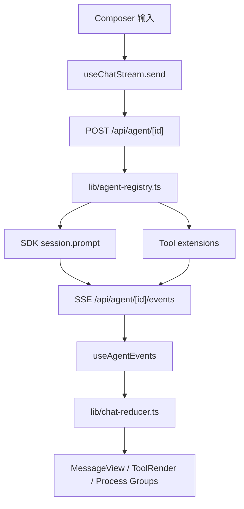
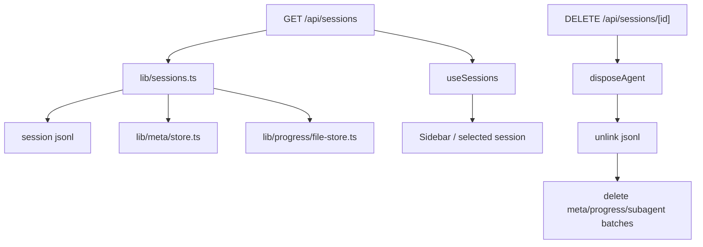
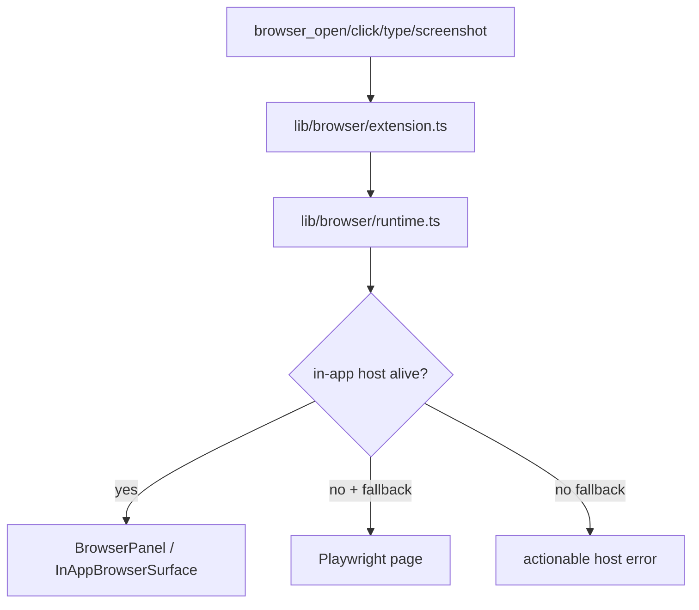
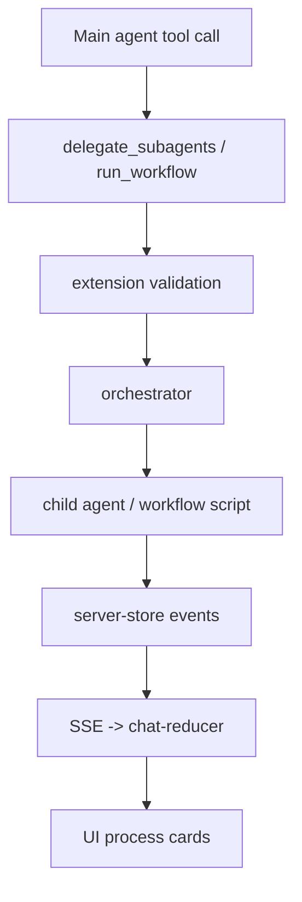

# Diga Agent Repo Model · 现状地图

> **状态**：Draft
> **创建**：2026-06-18
> **参考方法**：Understand-Anything 的“代码库建模”思路：先建立结构地图，再做审计和回归。
> **目标**：帮助我们从全局理解 diga-agent 当前架构、能力完成度、风险热区，以及后续 audit / acceptance 应该怎么接。

---

## 0. 一句话结论

diga-agent 现在已经不是单一聊天应用，而是一个 **Next.js Web App + Electron Shell + Agent Runtime + Tool Extensions + Session/Progress Persistence + Playwright E2E** 的复合型本地 agent 产品。

当前项目的主要矛盾不是“功能少”，而是：

1. 功能面已经很宽，模块之间耦合开始变重。
2. 关键用户体验依赖跨层链路，单元测试不容易覆盖。
3. 每次 AI review 都能发现新问题，说明缺少稳定的 repo model、审计清单和覆盖矩阵。
4. 端到端验收资产还没有产品化沉淀。

因此后续应该建立三层资产：

```text
repo-model/   # 代码结构与影响面地图
audit/        # 代码审计清单、发现问题、覆盖矩阵
acceptance/   # 黑盒验收场景、rubric、报告
```

---

## 1. 当前技术栈

| 层 | 当前实现 |
|---|---|
| Web UI | Next.js App Router + React |
| Desktop | Electron main/preload/server-wrapper |
| Agent SDK | `@earendil-works/pi-ai`、`@earendil-works/pi-coding-agent` |
| UI Icons | `lucide-react` |
| E2E | Playwright |
| Unit Test | Vitest |
| Runtime Tools | Browser、Subagents、Workflows、MCP、Goal、Progress、Clarification、Collab、Clipboard |
| Persistence | session jsonl/meta/progress/server-store/settings |

主要 scripts：

| Script | 用途 |
|---|---|
| `npm run dev` | Next dev server |
| `npm run electron:dev` | Electron dev |
| `npm run test` | Vitest |
| `npm run lint` | ESLint |
| `npm run build` | Next build |
| `npm run build:electron` | Electron build 前置构建 |
| `npm run release:smoke` | 发布冒烟 |

---

## 2. 顶层模块地图

```text
app/
  api/          Next API routes：agent、sessions、browser、preferences、tasks、workflows 等
  components/   聊天主 UI、Composer、MessageView、BrowserPanel、Settings 等
  hooks/        前端状态编排：stream、sessions、agent events、fork、search 等
  settings/     设置页分区
  mobile/       移动端配对/入口
  pet/          Pet 状态与推送

lib/
  agent-registry.ts   agent 生命周期与工具注入中心
  chat-reducer.ts     SSE/event -> message parts 的核心归并器
  sessions*.ts        session 列表、读取、fork、删除
  meta/               session meta
  progress/           progress runtime + persistence
  runtime/            runtime event store / event bridge
  browser/            browser tool + in-app host / Playwright fallback
  subagents/          delegate_subagents / orchestration / memory / policy
  workflows/          dynamic workflow / script runtime / worktree / network policy
  mcp/                MCP server registry/runtime/tool bridge
  collab/             approval/collaboration policy
  clarification/      clarification tool and store
  goal/               goal lifecycle/evidence/verifier
  agent-profiles/     profile axes + built-in profiles + settings

electron/
  main.js             Electron 主进程
  preload.js          renderer bridge
  server-wrapper.js   本地 Next server 包装
  security-policy.js  安全策略
  power-save.js       防休眠
  diag-*              诊断日志

e2e/
  00-14 *.spec.ts     传统 Playwright E2E
```

---

## 3. 核心运行链路

### 3.1 用户发送消息



关键文件：

- `app/components/Composer.tsx`
- `app/hooks/useChatStream.ts`
- `app/hooks/useAgentEvents.ts`
- `app/api/agent/[id]/route.ts`
- `app/api/agent/[id]/events/route.ts`
- `lib/agent-registry.ts`
- `lib/chat-reducer.ts`

风险点：

- `agent-registry.ts` 是工具注入和运行时状态中心，变更影响面大。
- `chat-reducer.ts` 承担大量事件归并，容易出现“状态显示不完整 / 过程无法展开 / 空气泡”。
- 前端 stream、event、session refresh 之间存在时序耦合。

### 3.2 Session 生命周期



关键文件：

- `app/api/sessions/route.ts`
- `app/api/sessions/[id]/route.ts`
- `app/api/sessions/[id]/fork/route.ts`
- `app/api/sessions/[id]/context/route.ts`
- `app/hooks/useSessions.ts`
- `lib/sessions.ts`
- `lib/meta/store.ts`
- `lib/progress/file-store.ts`

当前状态：

- 服务端一致性最近已有修复 commit。
- 前端 hooks、未读、运行中、fork 展示仍是高价值审计区。

### 3.3 Browser 工具链



关键文件：

- `lib/browser/extension.ts`
- `lib/browser/runtime.ts`
- `lib/browser/policy.ts`
- `app/components/BrowserPanel.tsx`
- `app/components/InAppBrowserSurface.tsx`
- `app/api/browser/[id]/route.ts`

当前状态：

- host disconnected 错误信息已增强。
- Web/Electron 的浏览器能力天然不同：Web 偏 iframe，Electron 偏 webview。
- 后续 acceptance 应重点覆盖 host stale、fallback、截图、点击、跨平台差异。

### 3.4 Subagents / Workflows



关键文件：

- `lib/subagents/extension.ts`
- `lib/subagents/orchestrator.ts`
- `lib/subagents/server-store.ts`
- `lib/workflows/extension.ts`
- `lib/workflows/orchestrator.ts`
- `lib/workflows/script-runtime.ts`
- `lib/workflows/server-store.ts`

当前状态：

- `delegate_subagents` 缺 `tasks` 截断已做可操作错误。
- workflow script runtime 已有大量单测。
- UI 展示、detach/end 事件、历史恢复仍是审计重点。

---

## 4. 功能完成度视图

| 能力域 | 当前成熟度 | 说明 |
|---|---:|---|
| 基础聊天 / streaming | 中高 | 主流程可用，但 process 状态显示仍在迭代 |
| Session 列表/删除/恢复 | 中 | 服务端逐步变稳，前端 hooks 仍需审计 |
| Fork / Branch | 中 | 能力存在，但需要回归“编辑后覆盖发送、乱序、超长树渲染” |
| Composer / Mention | 中 | 结构化输入、paste mentions 有测试，但 Electron 真实回归仍需 acceptance |
| Browser tool | 中 | runtime 能力有，host/fallback/平台差异要黑盒验收 |
| Subagents | 中 | orchestrator/extension 测试较多，UI/历史/截断要持续回归 |
| Workflows | 中高 | script runtime 和 policy 测试较多，是较成熟模块 |
| MCP | 中 | registry/runtime/tool bridge 有单测，真实 server 场景需 acceptance |
| Goal / Progress | 中 | 状态模型较丰富，但 UI“处理中/已处理/时长/展开”还需验收 |
| Agent Profiles | 低到中 | Phase A/B 已完成，只读展示已落地；尚未驱动运行时 |
| Electron | 中 | dev/start/build 都有，安全/防休眠/诊断有测试，仍需真实窗口回归 |
| Acceptance 系统 | 低 | 目前只有传统 e2e，没有产品化 scenario/rubric/report 体系 |
| Audit 系统 | 低 | 有散落审计报告，但没有 code-map/findings/coverage 闭环 |

---

## 5. 风险热区

### H1：`lib/agent-registry.ts`

职责过多：agent 生命周期、工具注入、progress、goal、approval、subagent、workflow、browser、MCP 都经过这里。

风险：

- 一个修复容易影响多条工具链。
- 错误恢复、dispose、streaming 状态很难靠单测覆盖完整。
- profile/toolset/approval 后续接入也会碰这里。

建议：

- 先做代码地图和调用链审计。
- profile 接入前，把工具注册 metadata 化。
- acceptance 覆盖“工具失败 / stop / retry / 运行中状态”。

### H2：`lib/chat-reducer.ts`

职责：把大量 runtime/SSE/tool events 归并成 message parts。

风险：

- 不同 tool event 组合容易制造空气泡、卡片卡死、不可展开。
- UI 里的“处理中/已处理/秒数”依赖这里和 MessageView 的组合。

建议：

- 建立 reducer event fixture 套件。
- 每个历史 UI bug 都变成 regression case。
- acceptance 用截图 + DOM 双断言。

### H3：Sessions / Fork / Branch

职责跨越 API、文件系统、meta、前端列表、branch popover。

风险：

- 删除一致性、fork 锚点归属、超长树、编辑后覆盖发送，都属于跨层问题。

建议：

- audit 先做 sessions checklist。
- acceptance 先收 `fork-edit-send-order` 和 `branch-tree-long`。

### H4：Browser host / Electron-Web 差异

Browser 体验依赖 Electron webview、Web iframe、in-app host、Playwright fallback。

风险：

- 同一个 tool 在 Web 和 Electron 表现不同。
- host stale 时错误不清楚会让 agent 不知道如何恢复。

建议：

- acceptance 区分 `surface: electron` / `surface: web`。
- 报告里记录 host 状态、fallback 是否启用。

### H5：Profiles 后续运行时接线

目前 profiles 是只读展示，后续要驱动 prompt、reasoning、display、toolset、approval、sandbox。

风险：

- 容易把“看起来切 profile”误认为“行为已改变”。
- approval/sandbox 如果只靠 prompt，会出现安全错觉。

建议：

- Phase C 只接 prompt/reasoning/display。
- Phase D 再接 toolset/approval。
- Phase E 前 UI 明确 sandbox 是软边界。

---

## 6. 测试资产现状

### 6.1 已有

| 类型 | 位置 | 状态 |
|---|---|---|
| Unit tests | `lib/**/*.test.ts`、`app/**/*.test.ts`、`electron/**/*.test.ts` | 覆盖面较广 |
| Playwright E2E | `e2e/00-14 *.spec.ts` | 已有基础产品流 |
| Release smoke | `scripts/release-smoke.mjs` | 有发布检查入口 |
| 静态检查 | `eslint`、`tsc`、自定义 check scripts | 已有 |

### 6.2 缺口

| 缺口 | 影响 |
|---|---|
| 没有 acceptance scenario 格式 | 真实用户回归无法沉淀 |
| 没有 rubric | 视觉/体验类 bug 难自动判断 |
| 没有审计 coverage 矩阵 | 不知道哪些区域真正读完了 |
| 没有 finding registry | AI review 发现的问题散落在聊天和文档 |
| 没有 diff -> impact -> test selection | 每次大量 commit 后无法精准回归 |

---

## 7. 建议新增的项目生产目录

### 7.1 Repo Model

```text
repo-model/
  graph.json
  domains.json
  impact-index.json
  README.md
```

第一阶段可以不自动生成，只用文档和脚本逐步逼近。

目标：

- 记录文件/模块/工具/路由关系。
- 支持后续“改了这些文件，需要跑哪些 audit/acceptance”。

### 7.2 Audit

```text
audit/
  README.md
  code-map.md
  coverage.md
  findings.yaml
  checklists/
    sessions.md
    agent-runtime.md
    chat-reducer.md
    browser.md
    subagents.md
    workflows.md
    security.md
  runs/
  templates/
```

目标：

- 把 AI review 从“自由聊天”变成“按区域、按清单、可复跑”的审计流程。
- 每次审计必须记录 files read、call chains、findings、regression。

### 7.3 Acceptance

```text
acceptance/
  README.md
  scenarios/
    smoke/
    regression/
    features/
  fixtures/
  rubrics/
  schemas/
  runners/
  reports/
  artifacts/
```

第一批 regression：

- `mention-at-undefined`
- `fork-edit-send-order`
- `process-expand-duration`
- `search-empty-target`
- `browser-host-disconnected`
- `subagent-tasks-truncation`
- `branch-tree-long`

---

## 8. 建议的理解路径

如果一个新 agent / 新同事要理解 diga-agent，不要从随机文件开始读。建议按这个路线：

1. 读 `package.json` 和顶层目录，理解 Web + Electron + runtime。
2. 读 `lib/agent-registry.ts`，理解 agent 生命周期和工具注入。
3. 读 `app/api/agent/[id]/route.ts` 和 `events/route.ts`，理解请求和 SSE。
4. 读 `app/hooks/useChatStream.ts` / `useAgentEvents.ts` / `lib/chat-reducer.ts`，理解前端事件归并。
5. 读 `app/components/MessageView.tsx` / `ToolRender.tsx` / `MessagesScrollArea.tsx`，理解过程展示。
6. 分别读 browser、subagents、workflows、sessions 四个能力域。
7. 最后读 e2e，理解产品验收已有覆盖。

---

## 9. 下一步行动

### P0：把这份文档升级成正式 repo-model 入口

- 建 `repo-model/README.md`。
- 从本文件提炼 `repo-model/domains.json` 初版。
- 先不追求函数级图谱，先做模块级图谱。

### P1：建立 audit 初版

- 建 `audit/code-map.md`。
- 建 `audit/findings.yaml`。
- 把现有 `docs/session-audit-report-2026-06-18.md` 拆入 `audit/runs/`。
- 建 `audit/checklists/sessions.md` 和 `audit/checklists/chat-reducer.md`。

### P2：建立 acceptance 初版

- 建 `acceptance/README.md`。
- 建 scenario schema。
- 落 7 个近期回归 case。
- 暂时不要求全部自动化，先让 Computer Use / Browser / 人工都能按同一份 scenario 执行。

### P3：增量影响分析

后续每次 commit 后，生成：

```text
changed files
-> affected domains
-> required audit checklists
-> recommended acceptance scenarios
```

这就是把 Understand-Anything 的“仓库理解”真正接到你的研发流程里。
